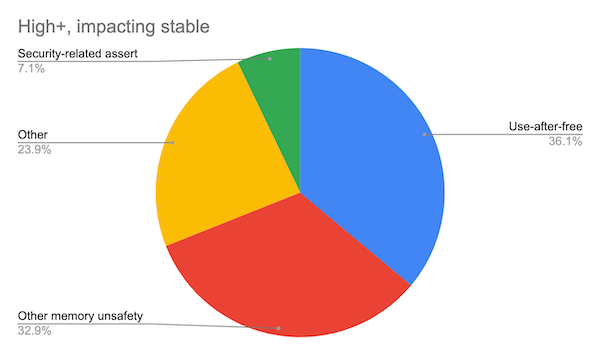
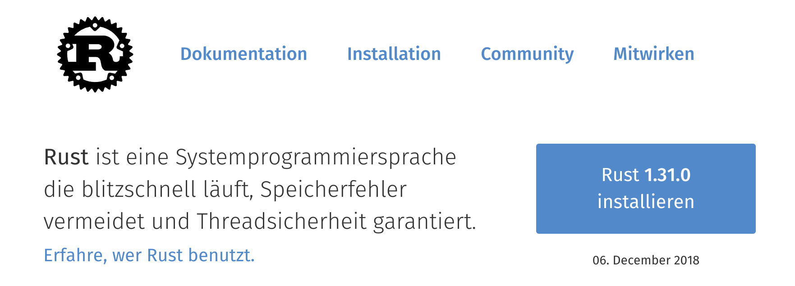
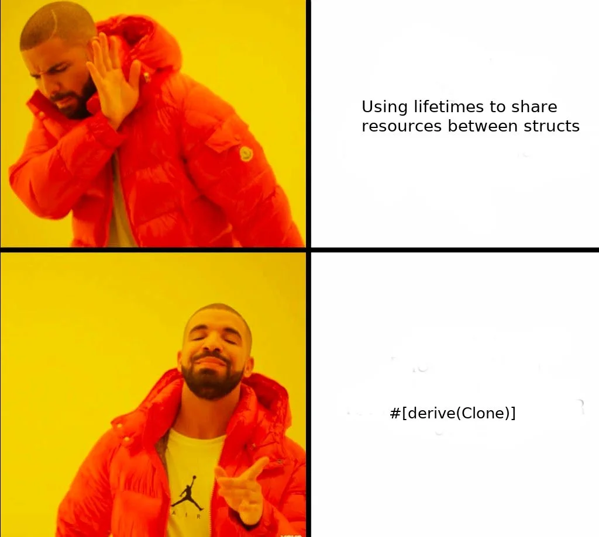
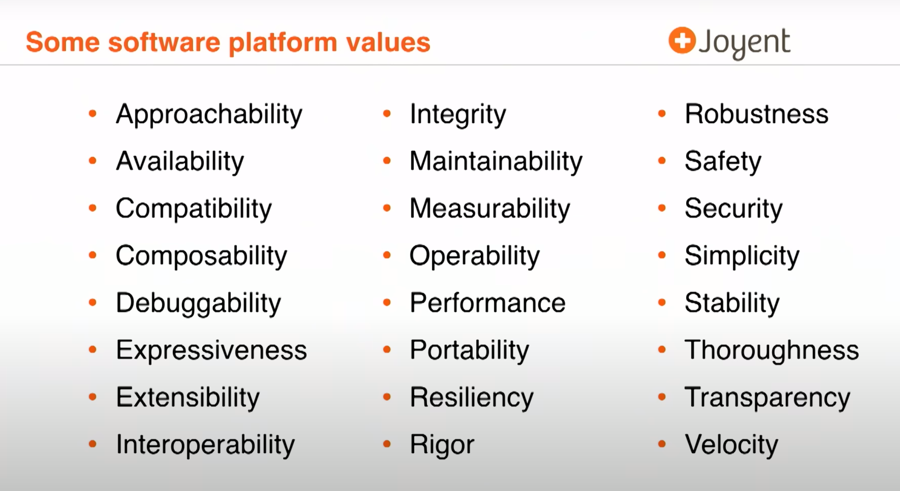
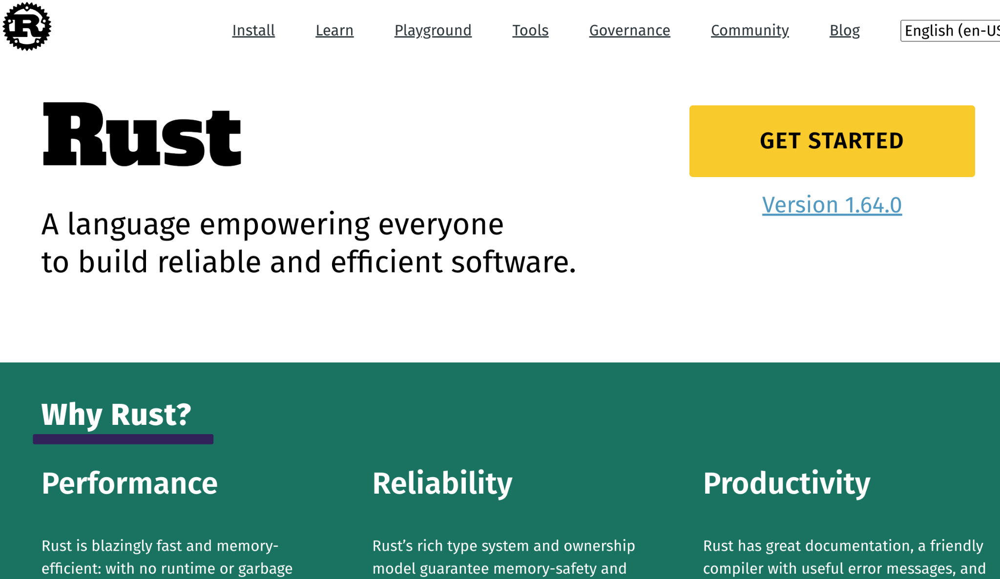
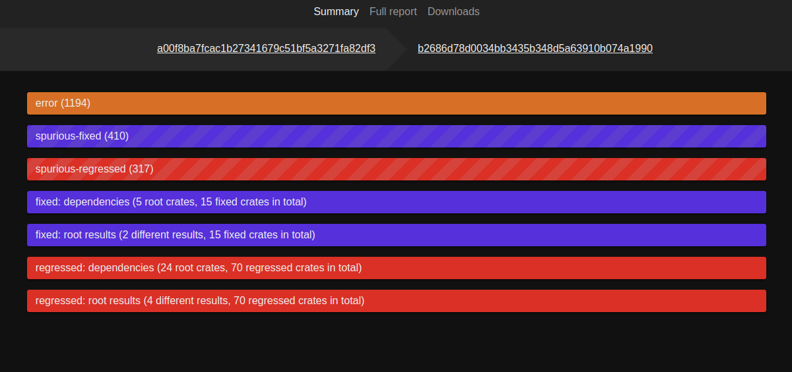
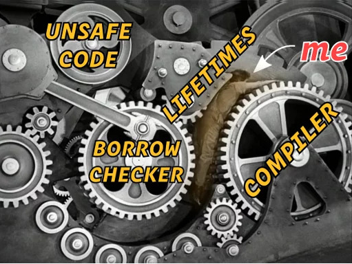
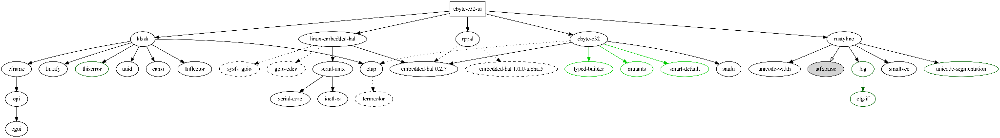
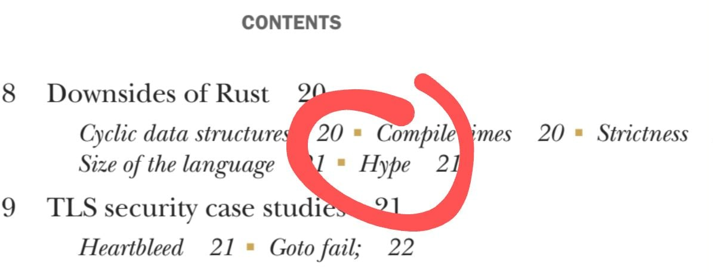

---

title: "Intro"
description: ""
marp: true
theme: rhea
color: "dark-gray"
size: 16:9

---

<!--
paginate: true
 -->
<!-- 
_footer: ''
_paginate: false
 -->
<!-- _class: lead -->

# Intro

## Rust Core Motivations and Values


---

<!-- header: ' '-->

## `$whoami`

.png)
- Learning Rust since 2016
- Embedded Work (C, C++, Rust)
- Automotive (Rust)
- Distributed Systems (Rust)
- Since 3 years: Rust Meetup Nuremberg
- Opensource on GitHub: [github.com/barafael](github.com/barafael)

---

## `$now`


- Intro Round
- Pls fill out "Teilnehmerliste"
- Material will be handed out via access to GH repo

---

## Heute

- Development history, motivations, philosophy of Rust
- Development environment
- Language Basics
  - Control flow, types, functions

Projects:
- [Luhns Algorithm](https://github.com/barafael/luhns-algorithm-exercise) ("Frontend" via CLI, REPL, WASM, tests)
- [Simple Web Page Downloader](https://github.com/barafael/wpdl), Extension: Web Server API testing tool

---

## Morgen

- References, Move Semantics, Sharing XOR Mutability
- Datastructures
- API Design, Resource Management, Multithreading

Projects:
- Platform-independent [driver](https://github.com/barafael/ebyte-e32-rs) for Ebyte E32 LoRa Modules
- [GUI/CLI Frontend](https://github.com/barafael/ebyte-e32-ui) for driver
- Multithreaded [renderer](https://github.com/cocomundo/julia-set-renderer) for Julia fractals

---


## Übermorgen

- Error Management
- Collections und Iteration
- Concurrency+Parallelism with `async`/`.await`
- Ecosystem overview

---

## Übermorgen

Projects:

- [Message Repeater TCP Server](https://github.com/barafael/msg-repeater)
- [Bare Metal Async I/O with embassy](https://github.com/barafael/really-fast-buttons)
- [Async I/O Example Programs with Tokio](https://github.com/barafael/achat)
- [Protohackers Exercises](https://github.com/barafael/protohackers) from [protohackers.com](protohackers.com)
- ["Learning Async Rust with Entirely Too Many Web Servers"](https://ibraheem.ca/posts/too-many-web-servers/)
- [The "Tokio Tutorial"](https://tokio.rs/tokio/tutorial)

---

<!-- _class: lead -->

# "Software is getting slower more rapidly than hardware is getting faster"

-- Niklaus Wirth (Turing Award Winner, designer of Pascal and others, ...), **1995**

<!-- _footer: '["A Plea for Lean Software"](https://www.computer.org/csdl/magazine/co/1995/02/r2064/13rRUwInv7E) -->

---

## Moores Law vs. Wirths Law

Moores Law is well known - [supposedly it is slowing slightly](https://www.power-and-beyond.com/moores-law-in-2022-whats-the-status-quo-a-dc63a87e669b554d4d33d2a5ba73692a/)

- **Performance** becomes more important
- **Concurrency** and **Parallelism** become more important
- **Power Consumption** becomes more important

---

## Rise of OOP and interpreted languages

- ~2000: Java, C#, Python, Ruby, ... rising popularity (for reasons)
  - Memory Safety through interpretation and GC
  - Tooling, ergonomics, productivity, portability

- System Programming left in the dust!
  - Garbage Collection not acceptable
  - Lack of control for interaction with OS/Hardware
  - Browser, Webserver, Databases, Compilers, Firmware, Operating systems, distributed systems, Communication
  - Lots of C, sometimes C++

---

## Resource- and Energy cost of software

"Performance" as in "time taken" is just one of many metrics

- Memory, Allocation behaviour, System Resources (threads, locks), Energy, CPU features (cache, SIMD, special instructions), Serialization/marshaling cost, startup cost of interpreters

Secondary metrics (systems languages usually lack here):

- Productivity, Ergonomics, Safety, Security, Tooling, Portability, static/dynamic analyzeability

---

## Resource- and Energy cost of software

- [Berkeley Lab: It Takes 70 Billion Kilowatt Hours A Year To Run The Internet](https://www.forbes.com/sites/christopherhelman/2016/06/28/how-much-electricity-does-it-take-to-run-the-internet/?sh=6323ae0f1fff)
- [Energy Consumption of the Internet](https://www.researchgate.net/publication/4334181_Energy_Consumption_of_the_Internet)

Very hard to measure, but:

- Enormous consumption in part caused by software
- This also leads to secondary inefficiency: more resources for servers+infrastructure
- BitCoin, ouch...

---

## But what about C, C++?

- "Core Values": Performance, Control, Compatibility

- **Not**: Safety, Security, Concurrency, Ergonomics, Tooling, Testing

- MISRA, ASpice, Frama-C, linting, etc.: partial post-hoc fixes

Difference between incidental complexity and inherent complexity
  - C++ has many reasonable but terrible historical baggage

<!-- _footer: '[Scale By The Bay 2018: Bryan Cantrill, Rust and Other Interesting Things](https://www.youtube.com/watch?v=2wZ1pCpJUIM)' -->

---

## Core Values: ["How Rust views Tradeoffs"](https://www.youtube.com/watch?v=2ajos-0OWts&t=823s)

<style scoped>
  iframe {
    margin:auto;
    margin-top: 50px;
    display:block;
}
</style>

<iframe width="830" height="480" src="https://www.youtube.com/embed/2ajos-0OWts?si=wU_Jge6XquxK9ipv" title="YouTube video player" frameborder="0" allow="accelerometer; autoplay; clipboard-write; encrypted-media; gyroscope; picture-in-picture; web-share" allowfullscreen></iframe>

---

## "~70% of exploited CVEs happen due to memory unsafety"



- Microsoft: [1](https://github.com/microsoft/MSRC-Security-Research/blob/master/papers/2020/Security%20analysis%20of%20memory%20tagging.pdf), [2](https://msrc-blog.microsoft.com/2019/07/16/a-proactive-approach-to-more-secure-code/)
- Apple: [3](https://langui.sh/2019/07/23/apple-memory-safety/)
- Chromium: [4](https://www.chromium.org/Home/chromium-security/memory-safety/)

---

## Original Goal

<style scoped>
li {
    font-size: 28px;
}
</style>

<div class="columns">

<div>

- Graydon Hoare, Conception 2006 

- Syntax and Semantics in flux:
Around 2010 Rust was Golang:
GC, Green Threads, Runtime,
Segmented Stacks, Exceptions

- 1.0-Release (2015) ends teenie phase

[Graydon Hoare 2010](http://venge.net/graydon/talks/intro-talk-2.pdf)
[Graydon Hoare 2012](http://venge.net/graydon/talks/rust-2012.pdf)

</div>

<div>

[Pre-2018 Motto](https://prev.rust-lang.org/de-DE/):
"Rust is a systems programming language that runs **blazingly fast**, **prevents segfaults**, and **guarantees thread safety**."



</div>

</div>

---

## Inofficial Motto

"Fearless Concurrency": this "idiom" may refer to parallelized CSS styling in Firefox, described [here](https://hacks.mozilla.org/2019/02/rewriting-a-browser-component-in-rust/)

"Official" post: [Fearless Concurrency with Rust](https://blog.rust-lang.org/2015/04/10/Fearless-Concurrency.html)

---

## Safety + Performance + Concurrency

- Goal: **"Fearless Concurrency"** via **"Sharing XOR Mutation"**
- Bye bye Data Races
- Functional: !Mutation, Python: Single threaded+synchronization, Java: optional synchronization, C: Don't care, Erlang/Elixir: !Sharing
- Rust: Sharing XOR Mutation
  - simple rules, enforced statically by compiler

---

## Simple Rules!

- Each value has one **owner**
- A value may be moved
- A value may be borrowed:
  - shared reference: look don't touch for many
  - mutable reference: there can only be one, but it may mutate
  - Moving and borrowing mutually exclude each other
- Owning a value brings the obligation to clean up

---

## Does it compile :question:

According to the rules from previous slide:

<style scoped>
code {
    font-size: 36px;
}
</style>

````rust tag:playground-button playground-wrap:main
let s1 = String::from("hello");
let s2 = s1;

println!("{s1}, world!");
````

---

## It doesn't :smile:

````
error[E0382]: borrow of moved value: `s1`
 --> src/main.rs:5:15
  |
2 |     let s1 = String::from("hello");
  |         -- move occurs because `s1` has type `String`, which does not implement the `Copy` trait
3 |     let s2 = s1;
  |              -- value moved here
4 |
5 |     println!("{s1}, world!");
  |               ^^^^ value borrowed here after move
  |
  ...
help: consider cloning the value if the performance cost is acceptable
  |
3 |     let s2 = s1.clone();
  |                ++++++++
````

---

## "Just Reference It"

Sometimes, references are preferable over moves. But, lifetimes become complicated.

````rust tag:playground-button playground-wrap:main
let s1 = String::from("hello");
let s2 = &s1;

println!("{s1}, world!");
````

---

## "Just clone It"

* Cloning only happens explicitly - it may not be cheap
* Cloning can be semantically wrong
* It's a simple way but expensive way to make the borrow checker happy:

````rust tag:playground-button playground-wrap:main
let s1 = String::from("hello");
let s2 = s1.clone();

println!("{s1}, world!");
````

---

<div class="columns">

<div>

````rust tag:playground-button playground-wrap:main
#[derive(Debug, Clone)]
pub struct Handle {
    //...
}
````

</div>

<div>



</div>

---

## “A platform as a reflection of its core values”

<style scoped>
  p {
    font-size:30px;
}
</style>

[Scale By The Bay 2018: Bryan Cantrill, Rust and Other Interesting Things](https://www.youtube.com/watch?v=2wZ1pCpJUIM)

<style scoped>
  iframe {
    margin:auto;
    margin-top: 15px;
    display:block;
}
</style>

<iframe width="830" height="480" src="https://www.youtube.com/embed/2wZ1pCpJUIM?si=hPkI1IGzKs7M0Mc_" title="YouTube video player" frameborder="0" allow="accelerometer; autoplay; clipboard-write; encrypted-media; gyroscope; picture-in-picture; web-share" allowfullscreen></iframe>

---

## “A platform as a reflection of its core values”

"Right Tool for the job" :arrow_right: "Right values for the job"

Value: "Positive traits that you are choosing among"

"Platform” defines itself by the traits it value"

Can’t have it all. If given a choice, which values are a priority?

---

## Core Values inform decisions

How to decide on the "Big Things"?

System Architecture, foundational invariants, Toolability, Interoperability with other systems...

"Which values are you ready to de-prioritize in favor of others?"

---



<!--
_footer: '[Scale By The Bay 2018: Bryan Cantrill, Rust and Other Interesting Things](https://www.youtube.com/watch?v=2wZ1pCpJUIM)'
-->

---

## A system is defined by its Core Values

**C**: Performant, Performant, Portable, Interoperable, Simple

**Scratch**: Approachable, Available, Simple

**Python**: Approachable, Simple, Portable, Expressive, Velocity

**Rust**: Performant, Safe, Secure, Maintainable, Robust

---

### A Core Value Mismatch is **not necessarily lethal** - <br>it merely **limits potential**

* Java does not have Pointers, yet it has the `NullPointerException` (famously, the "Billion Dollar Mistake")

* C is being used for operating system implementations, infecting these systems with C's low degree of security

* Linux: difficulty getting experienced young contributors (openness vs. gatekeeping)

* Out-Of-Order Execution CPUs: Valued Performance over Security, leading to Spectre + Meltdown

---

## Core Value Conflicts in Rust

* Highly rigorous syntax rules may produce unexpected situations (rigorosity vs. approachability)

* Debuggability in Async (performance vs. approachability)

* Programmer Productivity/Ergonomics and IDEability (productivity vs. correctness)

* Rust prides itself on being energy-efficient - yet the various integrity measures at the project level are wildly expensive (rigorosity vs. frugality)

---

## The next goals

<style scoped>
li {
    font-size: 22px;
}
</style>



What comes after "Fearless Concurrency"?

Since ~2018: "System Programming" for everyone

Even bigger goal:
Make "Systems Programming" and "Other Programming" be a **False Dichotomy**

---

## Tooling & Ecosystem

<style scoped>
li {
    font-size: 28px;
}
</style>

- Cargo: Build, dependencies, testing, documentation, benchmarks
- [crates.io](crates.io): Library repo
- Clippy: 99.9% Hit Rate Linting [(so many lints)](https://rust-lang.github.io/rust-clippy/master/index.html)

Tools:
depgraph, miri, tarpaulin, tomlfmt, tokei, kondo, cross, probe-rs, audit, licenses, nextest, ...

[docs.rs](docs.rs): Centrally hosted generated documentation
[Rust Analyzer](https://rust-analyzer.github.io/): IDE functionality via LSP
[Rustup](rustup.rs): Toolchain and component installation and management

---

## Tooling & Ecosystem

Before a new compiler release, [Crater](https://github.com/rust-lang/crater) loads most of [crates.io](crates.io).
It builds and tests them with the old and the new compiler
Purpose: detect compiler regressions with all known codebases.

[crater reports](https://crater-reports.s3.amazonaws.com/pr-104429/index.html)



---

## It ain't all flowers

- Complexity
  - Enormously large and a large variety of rules and paradigms
  - Domain Complexity creeps into the language
  - Rigorosity leads to surprising design choices
  - OOP is not favored - the compiler will fight object graphs
  - Rigorous error handling

Example: `f32` and `f64` do not fulfil `Eq`, `Ord`, `Hash` (at least `PartialEq` and `PartialOrd` though)

---

## It ain't all flowers

<style scoped>
img[alt~="bottom"] {
  display: block;
  margin: 0 auto;
  bottom: 0;
}
</style>



---

## It ain't all flowers

- Language is actively evolving ([in a controlled way](https://github.com/rust-lang/rfcs))
  - New release every 6 weeks (!) (regression testing via [crater](https://crater.rust-lang.org/))
  - New edition every 3 years (coordinated breaking changes)
- Moving Ecosystem
  - Many libraries are basically done, yet API is changing
  - Older one-person projects become unmaintained (they still compile though)
  - Giant dependency trees via transitive dependencies
- Supply chain is not particularly safe

---

## It ain't all flowers

[cargo-depgraph](https://crates.io/crates/cargo-depgraph/)

Cargo.toml:

````toml
[dependencies]
clap = { version = "3.1.14", features = ["derive"] }
ebyte-e32 = { version = "0.5.0", features = ["arg_enum"] }
embedded-hal = "0.2.7"
klask = { git = "https://github.com/barafael/klask.git" }
linux-embedded-hal = "0.3.2"
nb = "1.0.0"
rppal = { version = "0.13.1", features = ["hal", "hal-unproven"] }
rustyline = "9.1.2"
````

<!-- _footer: '[Example](https://github.com/barafael/ebyte-e32-ui#simplified-dependency-graph)' -->

---

## It ain't all flowers

And this is a harmless and simplified example!



<!-- _footer: '[Example](https://github.com/barafael/ebyte-e32-ui#simplified-dependency-graph)' -->

---

## It ain't all flowers

Asynchronous programming implementation is innovative, but not up-to-par with the rest of Rust.

<!-- But it's not as bad as the blog articles suggest! -->

<!-- Programming requires being careful again! -->

Complexity: deadlocks, busy spin, complex channel architectures, streams, actors

---

## It ain't all flowers

Bare-metal programming is [innovative, but there are problems](https://github.com/rust-embedded)
Libraries evolve very carefully (e-hal v1.0 soon)
WiFi, BlueTooth, USB, EtherCat etc. WIP support

(Native) GUI programming [immature](https://areweguiyet.com), lots of experimentation, nothing fully complete
VERY many different approaches in experimentation stage!

---

## It ain't all flowers

- Compiler is slow (at least it is polite)
  - Incremental compilation helps
  - Rust Analyzer helps
  - Continuous stream of improvements
  - monitored on [this dashboard](https://perf.rust-lang.org/dashboard.html)

  - Alternate compilers are in the works

---

## It ain't all flowers



<!-- _footer: '["Rust In Action" by Tim McNamara](https://livebook.manning.com/book/rust-in-action/chapter-1/v-11/125)' -->

---

## It ain't all flowers


---

## "Amateur Rust Historians"

<style scoped>
a, p {
    font-size: 28px;
}
</style>

[Steve Klabnik - The History of Rust](https://www.youtube.com/watch?v=79PSagCD_AY)

[Marijn Haverbeke - The Rust That Could Have Been](https://www.youtube.com/watch?v=olbTX95hdbg)

[Steve Klabnik - How Rust Views Tradeoffs](https://www.youtube.com/watch?v=2ajos-0OWts)

[Rust's Journey to Async/Await](https://www.youtube.com/watch?v=lJ3NC-R3gSI)

[Bryan Cantrill - Is It Time to Rewrite the Operating System in Rust?](https://www.youtube.com/watch?v=HgtRAbE1nBM)

[History of Rust with Ben Striegel - The Rustacean Station Podcast](https://rustacean-station.org/episode/042-ben-striegel/)

[graydon/rust-prehistory: historical archive of rust pre-publication development](https://github.com/graydon/rust-prehistory)

---

# The important communities (germany)

<style scoped>
li {
    font-size: 28px;
}
</style>

<div class="columns">

<div>

- Rust [Matrix](https://matrix.to/#/#rust:matrix.org)
- Rust Embedded [Matrix](https://matrix.to/#/#rust-embedded:matrix.org)
- [The Rust Programming Language Forum](https://users.rust-lang.org/)
- [Tokio Discord](https://discord.com/invite/tokio)
- Reddit: [The Rust Programming Language](https://rust.reddit.com)

</div>

<div>

- [berline.rs](berline.rs): Germanys largest and oldest Rust Online Meetup
- [rust-linz.at](https://rust-linz.at/): It's time for the steel city to Rust!
- [Rust Noris](https://www.meetup.com/de-DE/rust-noris/): Rust Nuremberg Meetup

</div>

</div>

---

## Review

- Wirths Law vs. Moores Law, Core Values
- Goal of Rust around 2018: "Safety, Performance, Concurrency"
- "A Platform as a Reflection of Values"
- Goal of Rust since 2021:
  "Empowering everyone to build reliable and efficient Software"
- Tooling + Ecosystem
- Downsides
- Communities
