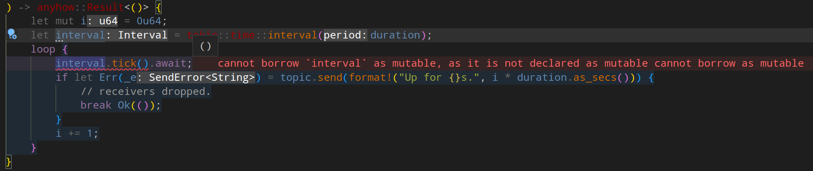
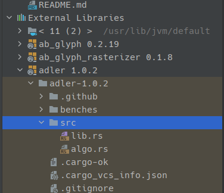

<!--
paginate: true
 -->
<!-- 
_footer: ''
_paginate: false
 -->
<!-- _class: lead -->

# Hello Rust<br>Getting Started


---

## Overview


Install Rust and the toolchain

Get to know Cargo and the ecosystem

Help choosing an IDE ecosystem

---

<!-- header: ' ' -->

## [rustup.rs](rustup.rs) - The Rust Toolchain Installer

"The benefit of using the Rustup toolchain manager instead of the standalone prepackaged Rust in the software repository is the ability to install multiple toolchains (...) for multiple targets (...) and architectures (...)."

<p style = "text-align: right">- Arch Wiki</p>

Rustup is the recommended installation method (not the distro package manager)

---

## [rustup.rs](rustup.rs) - The Rust Toolchain Installer

<p style = "text-align: center"><a href="https://www.rustup.rs">rustup.rs</a></p>

```bash
$> curl --proto '=https' --tlsv1.2 -sSf https://sh.rustup.rs | sh
```

Yes, it's `curl | sh`. It's kind of like downloading an installer?

For windows: [https://win.rustup.rs/x86_64](https://win.rustup.rs/x86_64)

---

## Rustup Commands

```bash
$ rustup update
$ rustup self update
$ rustup default nightly
$ rustup target add thumbv7em-none-eabihf
$ rustup target add wasm32-unknown-unknown
$ rustup component add clippy
$ rustup component add rustfmt
$ rustup component add rust-src
$ rustup show
$ rustup doc
```

---

## Installation Test: Rustlings

Rustlings is a collection of Rust Exercises, which include well-placed errors.
Goal: learn by repairing them.

<p style = "text-align: center"><a href="https://www.github.com/rust-lang/rustlings">github.com/rust-lang/rustlings</a></p>

```bash
curl -L https://raw.githubusercontent.com/rust-lang/rustlings/main/install.sh | bash
```

<p style = "text-align: center"><code>$> rustlings</code><br><code>$> rustlings watch</code></p>

---

## Docs via Rustup

Get the official book:

```
rustup docs --book
```

More general resources:

```
rustup docs
```

<!-- _footer: 'In case it doesn't work: `rustup component add rust-docs`' -->

---

## IDE via LSP: VSCode

LSP: Language Server Protocol by Microsoft
Decouples editor and IDE

[Rust Analyzer](https://rust-analyzer.github.io/) (Rust LSP) probably most important.
The other suggestions just make life easier.

---

## Plugins für VSCode


Recommended (ordered):

1. Rust Analyzer
2. Even Better TOML
3. Error Lens
4. crates
5. Crates Completer

---

## Even Better TOML

There was `TOML`, then `Better TOML`, now `Even Better TOML`...

General suggestion: `FormatOnSave: true`

But: can bloat the diff, can mess up live session

---

## VSCode LSP Integration

Quickfixes:


becomes:


---

## VSCode LSP Integration

Crate Version Management:


---

## Error Lens

Inline Errors:



---

## Inline Run + Debug Buttons

Work really well for unit tests:


---

## Hover Docs

Sometimes annoying:


---

## JetBrains Rust Support

Slightly outdated - JetBrains announced "Rust Rover".

But the functionality stays, it's just closed-source now (?).


---

## JetBrains Hover Tips


---

## JetBrains Inline Docs


---

## JetBrains Profiler

Nice thing about JetBrains: built-in test coverage.


---

## JetBrains `Cargo.toml` and Inspection

<style scoped>
table, tr, td, th {
  all: unset;
  border: 0 !important;
  background: transparent !important;
}
table { display: table; }
tr { display: table-row; }
td, th { display: table-cell; }

table {
  width: 100%;
}
td {
  vertical-align: middle;
  width: 10%;
  padding: 0 15px;
}
</style>
<table>
<td>


</td>
<td>



</td>
</tr>
</table>

---

## JetBrains Code Inspector


---

## Rustdoc ([barafael/achat](https://github.com/barafael/achat))


---

## Rustdoc

Includes + deeply links dependency docs.
Includes runnable doc-tests.


---

## Rustdoc

<style scoped>
li {
    font-size: 28px;
}
</style>

<div class="columns">

<div>

It's just Markdown:


Just start with `///` or `//!`.

</div>

<div>

Inline code in docs is tested:


</div>

</div>

<!-- _footer: 'I know the images are tiny. Check out the directory `achat` for more!' -->

---

## Continuous Integration on GitHub (4 clicks)

Bunch of sections like this one:

````yaml
jobs:
  build:

    runs-on: ubuntu-latest

    steps:
    - uses: actions/checkout@v3
    - name: Build
      run: cargo build --verbose
    - name: Run tests
      run: cargo test --verbose
````

---

## Continuous Integration on GitHub (4 clicks)

Bunch of sections like this one:

````yaml
      - name: cargo doc --document-private-items
        uses: actions-rs/cargo@v1
        with:
          command: doc
          args: --document-private-items --no-deps --all-features
````

---

## Cross-Compiling CI

Setup + install flip-link

````yaml
runs-on: ubuntu-latest
steps:
  - uses: actions/checkout@v2
  - uses: actions-rs/install@v0.1
    with:
      crate: flip-link
      version: latest

````

<!-- _footer: '[CuteCopter CI](https://github.com/barafael/cute-copter/blob/main/.github/workflows/rust.yml)' -->

---

## Cross-Compiling CI

Install toolchain, tools, custom target thumbv7m, then build

````yaml
  - uses: actions/checkout@v2
  - name: Install latest nightly
    uses: actions-rs/toolchain@v1
    with:
        toolchain: nightly
        override: true
        components: rustfmt, clippy
  - name: Build

    run: rustup target add thumbv7m-none-eabi && cargo build --release --verbose
````

<!-- _footer: '[CuteCopter CI](https://github.com/barafael/cute-copter/blob/main/.github/workflows/rust.yml)' -->

---

## Clippy: 99.9% Linter

No more poking through linter output to find nuggets.

````rust tag:playground-button playground-wrap:main
let x = [1, 2, 3];
let _ = x.iter().zip(0..x.len());
````

<div data-marpit-fragment>

````
warning: it is more idiomatic to use `x.iter().enumerate()`
 --> src/main.rs:3:13
  |
3 |     let _ = x.iter().zip(0..x.len());
  |             ^^^^^^^^^^^^^^^^^^^^^^^^
  |
  ...
  = note: `#[warn(clippy::range_zip_with_len)]` on by default
````

</div>

---

## Clippy: 99.9% Linter

<div class="columns">

<div>

````rust tag:playground-button playground-wrap:main
(0_i32..10)
    .filter(|n| n.checked_add(1).is_some())
    .map(|n| n.checked_add(1).unwrap());
````

````rust tag:playground-button playground-wrap:main
let _ = 'a'..'z';
````

````rust tag:playground-button playground-wrap:main
let x = 3.14;
let y = 1_f64 / x;
````

````rust tag:playground-button
use std::future::Future;
fn foo() -> impl Future<Output = i32> { async { 42 } }
````

</div>

<div>

````rust tag:playground-button playground-wrap:main
struct Foo {
    bar: bool
}

impl Default for Foo {
    fn default() -> Self {
        Self {
            bar: false
        }
    }
}
````

<div>

---

## Clippy Lint List

<style scoped>
  iframe {
    margin:auto;
    display:block;
}
</style>

<iframe style="margin:auto" width="1200" height="540" src="https://rust-lang.github.io/rust-clippy/master/index.html" title="YouTube video player" frameborder="0" allow="accelerometer; autoplay; clipboard-write; encrypted-media; gyroscope; picture-in-picture; web-share" allowfullscreen></iframe>

<!-- _footer: '[Lint List](https://rust-lang.github.io/rust-clippy/master/index.html)' -->

---

## Coverage Analyzer: Tarpaulin

Line coverage only, other coverages been planned for long time...

````
May 16 23:31:18.162  INFO cargo_tarpaulin::report: Coverage Results:
|| Tested/Total Lines:
|| src/command.rs: 12/14
|| src/lib.rs: 95/125
|| src/product_info.rs: 31/34
|| src/sample.rs: 28/31
|| src/test.rs: 162/163
||  
89.37% coverage, 328/367 lines covered
````

<!-- _footer: '[Tarpaulin on crates.io](https://crates.io/crates/cargo-tarpaulin)' -->

---

## Unused dependencies: Cargo Udeps

````
$ cargo udeps --all-targets --all-features
   Compiling anyhow v1.0.68
    Checking julia-set-renderer v0.1.0 (/home/ra/julia-set-renderer)
    Finished dev [unoptimized + debuginfo] target(s) in 0.93s
...
unused dependencies:
`julia-set-renderer v0.1.0 (/home/ra/julia-set-renderer)`
└─── dependencies
     └─── "anyhow"
````

<!-- _footer: '[Udeps on crates.io](https://crates.io/crates/cargo-udeps)' -->

---

## Dependency graph: Cargo Depgraph


<!-- _footer: '[Depgraph on crates.io](https://crates.io/crates/cargo-depgraph)' -->

---

## Module Graph: Cargo Modules

<div class="columns">

<div>


</div>

<div>


</div>

<!-- _footer: '[Modules on crates.io](https://crates.io/crates/cargo-depgraph)' -->

---


## Detect Undefined Behaviour: [MIRI](https://github.com/rust-lang/miri)

Detects Undefined Behaviour by running Rust on an interpreter.

See for example: https://github.com/Boddlnagg/midir/issues/137

````rust tag:playground-button playground-wrap:main
const NBYTES: usize = 4;
let message: [u8; NBYTES] = [1, 2, 6, 5];
let packet: u32 = 0;
let ptr = &packet as *const u32 as *mut u8;
for i in 0..NBYTES {
    unsafe { *ptr.offset(i as isize) = message[i] };
}
````

<!-- _footer: '[Another example](https://play.rust-lang.org/?version=stable&mode=debug&edition=2021&code=use+std%3A%3Aptr%3A%3A%7Baddr_of%2C+addr_of_mut%7D%3B%0A%0Aconst+N%3A+usize+%3D+10%3B%0Aconst+DATA%3A+%5Bu8%3B+12%5D+%3D+%5B1%2C+2%2C+3%2C+4%2C+5%2C+6%2C+7%2C+8%2C+9%2C+10%2C+1%2C+212%5D%3B%0A%0Afn+main2%28%29+%7B%0A++++let+mut+packet%3A+u32+%3D+0%3B%0A++++let+ptr+%3D+addr_of_mut%21%28packet%29.cast%3A%3A%3Cu8%3E%28%29%3B%0A++++for+%28i%2C+item%29+in+DATA.iter%28%29.enumerate%28%29.take%28N%29+%7B%0A++++++++unsafe+%7B+*ptr.add%28i%29+%3D+*item+%7D%3B%0A++++%7D%0A++++println%21%28%22%7Bpacket%3Ab%7D%22%29%3B%0A%7D%0A%0Afn+main%28%29+%7B%0A++++let+mut+packet%3A+u32+%3D+0%3B%0A++++let+ptr+%3D+%26mut+packet+as+*mut+u32+as+*mut+u8%3B%0A++++for+i+in+0..N+%7B%0A++++++++unsafe+%7B+*ptr.offset%28i+as+isize%29+%3D+DATA%5Bi%5D+%7D%3B%0A++++%7D%0A++++println%21%28%22%7Bpacket%3Ab%7D%22%29%3B%0A%7D%0A)' -->

---

## Review


- Rustup and installation
- Rustlings
- Docs/Book via Rustup
- VSCode and Plugins
- JetBrains/RustRover
- Rustdoc
- CI, Linting, Tools
- MIRI
