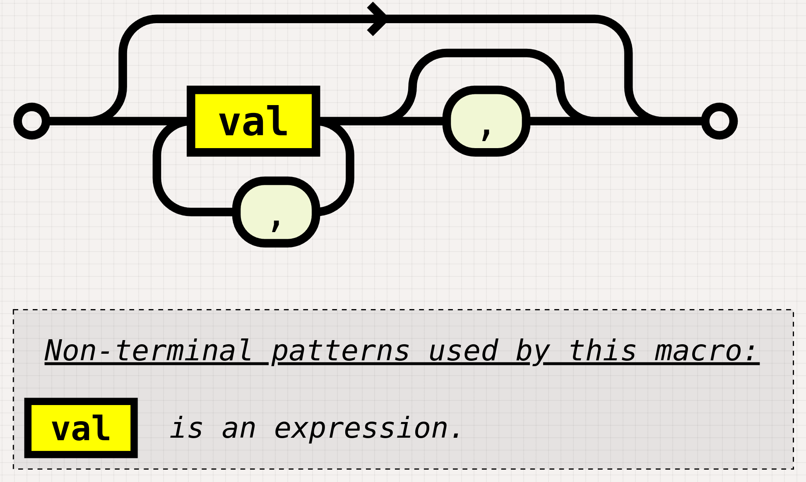

---

title: "Bindings and Types"
description: ""
marp: true
theme: rhea
color: "dark-gray"
size: 16:9

---

<!--
paginate: true
 -->
<!-- 
_footer: ''
_paginate: false
 -->
<!-- _class: lead -->

# Bindings and Types

<br>

## How to bind values to names


---

## Overview


Binding values to names

Console output basics

Immutability and functional basics

Mutability

Basics of types

---

<!-- header: ' '-->

## There Are No Variables

There are **Bindings** instead! It's a conceptual difference.

````rust tag:playground-button playground-wrap:main
let age = 4;
let name = "Eric";
````

<div data-marpit-fragment>

**Values** are bound to **Names**.

These bindings above are **immutable**!

</div>

---

## Immutable?

Incrementing a "variable":

````rust tag:playground-button playground-wrap:main
let age = 4;
age += 1;
````

<div data-marpit-fragment>

````
error[E0384]: cannot assign twice to immutable variable `age`
2 |     let age = 4;
  |         ---
  |         first assignment to `age`
  |         help: consider making this binding mutable: `mut age`
3 |     age += 1;
  |     ^^^^^^^^ cannot assign twice to immutable variable
````

</div>

---

## Immutable!

An immutable binding to a value means:

the value cannot be changed through that binding.

The Mutable/Immutable distinction is important.
It plays a role all over Rust.

Example: Immutability is the trivial way to achieve safe sharing of data in more than one thread.

---

## Quick HowTo: Console output

Now that we know how to bind values, lets do something with them.

````rust tag:playground-button playground-wrap:main
let name = "Ulysses";
println!("Hi, {}", name);
println!("Nice to meet ya, {name}");
````

<div data-marpit-fragment>

This uses the "display trait" for formatting.
"Display" is intended for user-facing representation.

</div>

---

## [`println!`](rust:std::println) and output formatting

To print a value using its "debug representation":

````rust tag:playground-button playground-wrap:main
let dir = std::env::current_dir().unwrap();
let id = std::process::id();

println!("dir: {:?}", dir);
println!("id: {:?}", id);
````

<!-- _footer: 'The `:?` means debug. `:#?` is debug with pretty-print.' -->

---

## [`println!`](rust:std::println) and output formatting

A single identifier can be inlined in the format string:

````rust tag:playground-button playground-wrap:main
let pi_half = std::f64::consts::PI / 2.0;
println!("display: {pi_half}; 5 decimal places: {pi_half:.5}");
````

<!-- _footer: '`f64` has not only debug but also display formatter, so `{a}` works too' -->

---

## [`println!`](rust:std::println) and output formatting

However, expressions of any other kind (other than identifiers) do not work:

````rust tag:playground-button playground-wrap:main
let pi_half = std::f64::consts::PI / 2.0;
println!("display: {pi_half * 2.0}");
````

This may change in the future.

---

## Pretty-Printing

The pretty-printer can come in handy:

````rust tag:playground-button playground-wrap:main
println!("{:#?}", std::fs::read_to_string("nofile.txt"));
````

<div data-marpit-fragment>

````
Err(
    Os {
        code: 2,
        kind: NotFound,
        message: "No such file or directory",
    },
)
````

</div>

---

## The [`dbg!`](rust:std::dbg!) macro

It's kind of like [`println!`](rust:std::println).

- uses [`Debug`](rust:std::fmt::Debug) formatting (`:?`)
- does not require a format string
- wraps around the expression it prints (`tee`-like)

<div data-marpit-fragment>

````rust tag:playground-button playground-wrap:main
let filtered_sum: i32 = [1, 2, 3, 4, 5, 6, 7]
    .into_iter()
    .map(|e| dbg!(e + 10))
    .filter(|e| e % 2 == 0)
    .sum();
````

</div>

---

# Why the exclamation mark?

It's a macro, meaning it can take an arbitrary number of arguments with varying types.
It can also [`return`](keyword:return) the calling function.

```rust tag:playground-button playground-wrap:main
println!("path: {}", env!("PATH"));
```

[`env!`](rust:std::env!) is another macro. It evaluates environment variables _at compile time_.

---

## Aside: Macro Visualization



<!-- _footer: '[macro_railroad](https://github.com/lukaslueg/macro_railroad_ext)' -->

---

## Bindings and Scope

A binding is valid only in its own scope (block).
Scopes are enclosed by `{` and `}`.

````rust tag:playground-button playground-wrap:main
let a = 4;
{
    let a = 5;
    let b = false;
    println!("{a}");
}
println!("{a}");
// println!("{b}");
````

<!-- _footer: 'Deconstruction happens at end of a scope, in opposite order of construction.' -->

---

## Special Binding Names

To immediately deconstruct a value when it is being bound:

````rust tag:playground-button playground-wrap:main
let _ = some_fn_with_effect();
````

This can be used (sparingly) to get rid of "unused value" warnings.

Real-life examples [here](https://github.com/search?type=code&auto_enroll=true&q=%22let+_+%22+language%3ARust+).

---

## Special Binding Names

An unused variable:

````rust tag:playground-button playground-before:$"fn some_function() -> String { todo!() } fn main() {"$ playground-after:$"}"$
let name = some_function();
````

<div data-marpit-fragment>

````
warning: unused variable: `name`
 --> src/main.rs:6:9
  |
6 |     let name = some_function();
  |         ^^^^ help: if this is intentional, prefix it with an underscore: `_name`
````

</div>

---

## Special Binding Names

To suppress "unused binding" warnings:

````rust tag:playground-button playground-before:$"fn some_function() -> String { todo!() } fn main() {"$ playground-after:$"}"$
// means: "`_name` is unused, pls no compiler warnings".
let _name = some_function();
````

<!-- _footer: 'In this case, the value is still kept alive until the end of its scope.' -->

---

## Preview: Binding and Patterns

The part after [`let`](keyword:let) is special - it's a **Pattern**.
Simple patterns: `a`, `name`, or `_`.

Patterns can also destructure the value on the right-hand-side:

````rust tag:playground-button playground-wrap:main
let (before, after) = "012345678".split_at(4);
println!("{before}, then {after}");
````

<!-- _footer: 'There is more to this. Patterns will come in again and again later!' -->

---

## Preview: Binding and Patterns

Structures can unsurprisingly also be destructured:

````rust tag:playground-button playground-before:$"use anyhow::Context; struct Message { content: String, sender: String, receiver: String,tag: bool } enum Tag {Instant, Async}"$ playground-after:$""$
#[tokio::main]
async fn main() -> anyhow::Result<()> {
    let (_server, mut client) = tokio::sync::mpsc::channel(16);
    let Message {
        sender,
        content,
        tag,
        ..
    } = client.recv().await.context("channel closed")?;
    Ok(())
}
````

---

## Mutable Bindings

A binding can simply be made mutable by the keyword [`mut`](keyword:mut):

````rust tag:playground-button playground-before:$"fn main(){"$ playground-after:$"dbg!(a);}"$
let mut a = 5;
a += 4;
````

<div data-marpit-fragment>

This works inside destructuring patterns, too:

````rust marker:mutable_binding_in_destructuring_pattern

````

</div>

---

## Mutable Bindings

A mutable binding means the bound value may be changed through this binding.

````rust tag:playground-button playground-before:$"fn main(){"$ playground-after:$"dbg!(acc);}"$
let mut acc = 0;
for i in [1, 2, 3, 4] {
    acc += i;
}
````

Somewhat surprisingly, you can often get away without mutability.

---

## Preview: Iterator Combinators

Mutation is not required when using iterator combinators:

````rust tag:playground-button playground-before:$"fn main(){"$ playground-after:$"dbg!(sum);}"$
let sum = [1, 2, 3, 4].iter().fold(0, |acc, n| acc + n);
````

Fold is like `reduce` in other languages.

<div data-marpit-fragment>

More concisely:

````rust tag:playground-button playground-before:$"fn main(){"$ playground-after:$"dbg!(sum);}"$
let sum = [1, 2, 3, 4].iter().sum::<u8>();
````

</div>

---

## Preview: Server Loop with only one [`mut`](keyword:mut)

````rust marker:server_cliche_loop hide_other_markers

````

---

## Idiomatic Re-binding

Re-binding to the same name drops the previous value.
This is idiomatic in Rust!

````rust tag:playground-button playground-before:$"use std::path::PathBuf; use serde::{Serialize, Deserialize}; #[derive(Debug, Serialize, Deserialize)] pub struct Config {    name: PathBuf,    limit: u8,}fn main() {"$ playground-after:$"}"$
let config = std::fs::read_to_string("config.yaml").unwrap();
let config: Config = serde_yaml::from_str(&config).unwrap();
````

<!-- _footer: 'Note that the type may change in shadowed bindings.' -->

---

## What about Types?

Every binding has a type. It can usually be omitted.

To manually annotate the type of a bound value:

````rust tag:playground-button playground-wrap:main
let x: u8 = 5;
let name: String = "Bohica".to_string();
````

<!-- _footer: 'The [Hindley-Milner Type Inference](https://reasoning.page/2022/12/11/hindley-milner-type-inference-in-rust/) algorithm determines the type of all bindings.' -->

---

## Inline Type Annotations

Some literals may be annotated with type information:

````rust tag:playground-button playground-wrap:main
let some_byte/*: u8*/ = 0u8;
let byte_str/*: &[u8]*/ = b"bytes! Just bytes! No Unicode!";
````

The default type of integer literals is assumed to be `i32`:

````rust tag:playground-button playground-before:$"fn print_type_of<T>(_: T) { println!("{}", std::any::type_name::<T>()) }fn main() {"$ playground-after:$"}"$
print_type_of(3);
````

---

## Ambiguous Integer Types

Sometimes the inference cannot help:

````rust tag:playground-button playground-wrap:main
let abs = 3.abs();
````

<div data-marpit-fragment>

````
error[E0689]: can't call method `abs` on ambiguous numeric type `{integer}`
 --> src/main.rs:2:17
  |
2 |     let abs = 3.abs();
  |                 ^^^
  |
help: you must specify a concrete type for this numeric value, like `i32`
  |
2 |     let abs = 3_i32.abs();
  |               ~~~~~
````

</div>

---

## Ambiguous Integer Types

With type annotation, it isn't a problem:

````rust tag:playground-button playground-wrap:main
let abs: u8 = 3.abs();
````

<div data-marpit-fragment>

Of course, you can also follow the compiler suggestion:

````rust tag:playground-button playground-wrap:main
let abs = 3_i32.abs();
````

</div>

---

## Providing Context for Type Inference

Type inference needs some context information to do its magic.

````rust tag:playground-button playground-before:$"fn main(){"$ playground-after:$"dbg!(result);}"$
let abs = 3.abs();
let result = abs + 1u8;
````

Function signatures require stating a full type.
This vastly simplifies type inference (and improves readability!).

---

## Review

.png)

- Bindings
- Immutability
- [`println!`](rust:std::println!) and other macros
- Scope
- Special bindings
- Mutability
- Rebinding
- Types

---

## Questions?

<iframe style="margin-top:5%" width="100%" height="80%" src="https://play.rust-lang.org/?version=stable&mode=debug&edition=2021&code=fn+main%28%29+%7B%7D%0A">
</iframe>
