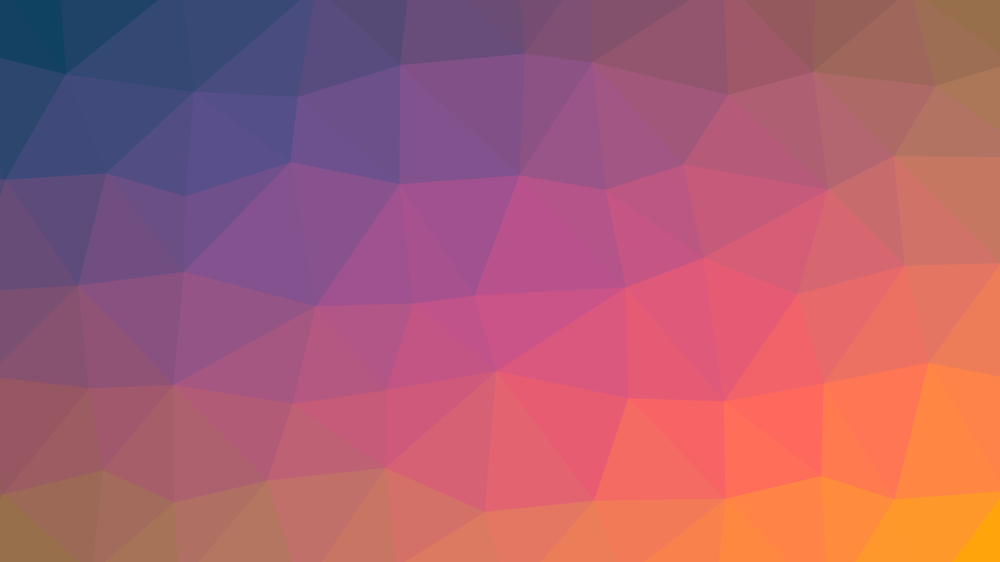

---

title: "Expressions and Control Flow"
description: ""
marp: true
theme: rhea
color: "dark-gray"
size: 16:9

---

<!--
paginate: true
 -->
<!-- 
_footer: ''
_paginate: false
 -->
<!-- _class: lead -->

# Expressions and Control Flow



---

## Overview


Ultimately, coding is **expression**.

It shouldn't be surprising that control flow is also just an **expression**.

---

<!-- header: ' '-->

## Expressions are declarative

Expression: specifies a calculation to be performed.

Expression:
````rust tag:playground-button playground-before:$"fn main() { let vals = [1,2,3,4,5,6,7];"$ playground-after:$";}"$
vals[3] + u8::min(5, 6)
````

<div data-marpit-fragment>

An expression can be suppressed via `;`.
This can be used to bind a value to a name ([`let`](keyword:let)):

````rust
let a = vals[3] + u8::min(5, 6);
````

</div>

---

## Statements are imperative

Statement: specifies an action to be performed.

Statement(-like expression):

````rust
*GLOBAL_HANDLE.lock().unwrap() = Some(handle);
````

Assignments (via [`let`](keyword:let) or like above) really are re-bindings of new values to existing bindings.

---

## Statement or Expression?

Why is `++` not a thing in Rust?

````rust tag:playground-button playground-wrap:main
let mut age = 4;
age++;
````

<div data-marpit-fragment>

`++` is both an expression (evaluates) and a statement (has an effect).
Execution order is unspecified in pathological cases (`c++ + c++`).

</div>

---

## Expressions in blocks

A block can be used to group expressions.

````rust tag:playground-button playground-wrap:main
let a = { 5 };
````

<div data-marpit-fragment>

A block with a sequence of "statements" evaluates to the value of the last expression in it:

````rust tag:playground-button playground-before:$"fn main() {"$ playground-after:$"dbg!(a);}"$
let a = {
    let a = 1 + 2;
    let b = a + a;
    b
};
````

</div>

---

## Expressions of type [`()`](https://doc.rust-lang.org/std/primitive.unit.html#)

When empty, or when terminated by a `;`, the type of a block will be [`()`](https://doc.rust-lang.org/std/primitive.unit.html#).

````rust tag:playground-button playground-wrap:main
{ };
{ 5; };
{ println!("println returns `()`")};
````

---

## "Special Blocks": `if`

If-expressions can be viewed as special block expressions.

````rust tag:playground-button playground-before:$"fn main() {let a = 4;"$ playground-after:$"dbg!(value);}"$
let value = if a < 7 { "less" } else { "greater-equals" };
````

This is just like the "ternary operator", but generalized.

---

## "Special Blocks": `if`

The syntax differs quite a bit from other languages:

````c
char* value;
if (a < 7) value = "less";
else value = "greater-equals";
````

<div data-marpit-fragment>

The braces are mandatory, the parentheses are not.
<!-- try putting parentheses around the condition in the playground -->

````rust tag:playground-button playground-wrap:main
let value = if a < 7 { "less" } else { "greater-equals" };
````

</div>

---

## But, what if...

What if there was no [`else`](keyword:else)?

````rust tag:playground-button playground-before:$"fn main() {let a = 4;"$ playground-after:$"dbg!(value);}"$
let value = if a < 7 { "less" };
````

<div data-marpit-fragment>

````
error[E0317]: `if` may be missing an `else` clause
3 |       let value = if a < 7 {
  |  _________________^
4 | |         "less"
  | |         ------ found here
5 | |     };
  | |_____^ expected `&str`, found `()`
  = help: consider adding an `else` block that evaluates to the expected type
````

</div>

---

## But, what if...

What if the [`else`](keyword:else) branch **diverges**?

````rust tag:playground-button playground-before:$"fn main() {let a = 4;"$ playground-after:$"dbg!(value);}"$
let value = if a < 7 {
    "less"
} else {
    std::process::exit(1);
};
````

The [`Never Type`](rust:std::convert::Infallible) is the secret sauce here.
It's the only subtype that exists (it can become any other type).

---

## Match as a generalized `else-if` chain

````rust tag:playground-button playground-wrap:main
let small = 2;
let text = match small {
    1 => "one",
    2 => "two",
    _ => "a lot...",
};
````

---

## "Special Blocks": [`loop`](keyword:loop)

It's nothing surprising:

````rust tag:playground-button playground-wrap:main
let values = [1, 3, 4, 8];
let mut index = 0;

loop {
    println!("{}", values[index]);
    index += 1;
    if index == values.len() {
        break;
    }
}
````

---

## "Special Blocks": [`for`](keyword:for)

Of course, [`for`](keyword:for)-style loops are a thing:

````rust tag:playground-button playground-wrap:main
let values = [1, 3, 4, 8];
for value in values {
    println!("{value}");
}
````

---

## "Special Blocks": Iterators preview

Somewhat beyond "Expressions and Control Flow":

````rust tag:playground-button playground-wrap:main
[1, 3, 4, 8].for_each(|elem| println!("{elem}"));
````

`|e| e.process()` is just a closure.

<!-- _footer: 'We'll see way more of that later' -->

---

## "Special Blocks": [`loop`](keyword:loop)

[Breaking](keyword:break) from a loop makes that the value of the loop block:

````rust tag:playground-button playground-wrap:main
let end = loop {
    let value = do_thing();
    if end_condition() {
        break value;
    }
};
````

---

## "Special Blocks": [`loop`][keyword:loop]

In a function returning `Ok(())` or `Err(...)`

````rust marker:break_loop_with_value

````

---

## "Special Blocks": [`loop`](keyword:loop)

The [`Never Type`](rust:std::convert::Infallible) strikes again:

````rust tag:playground-button playground-wrap:main_anyhow
let end = loop {
    let value = do_thing();
    if end_condition() {
        break value;
    }
    if final_condition() {
        anyhow::bail!("Error occurred");
    }
};
````

---

## "Special Blocks": [Functions!](keyword:fn)

A function can be seen as a special kind of block:

````rust tag:playground-button
fn random() -> u32 {
    4 // chosen by fair dice roll.
      // guaranteed to be random.
}
````

---

## Aside: Closures

The combinators seen earlier compose:

````rust tag:playground-button playground-wrap:main
[1, 3, -4, 8, 0]
    .into_iter()
    .map(i32::signum)
    .inspect(|sign| println!("{sign}"))
    .sum::<i32>();
````

---

## Aside: Closures

Equivalent, but less nice:

````rust tag:playground-button playground-wrap:main
[1, 3, -4, 8, 0]
    .into_iter()
    .map(|elem| elem.signum())
    .inspect(|sign| {
        println!("{sign}");
    })
    .sum::<i32>();
````

---

## Questions?

<jframe style="margin-top:5%" width="100%" height="80%" src="https://play.rust-lang.org/?version=stable&mode=debug&edition=2021&code=fn+main%28%29+%7B%7D%0A">
</iframe>
