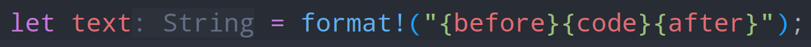

---

title: "Not so basic types"
description: ""
marp: true
theme: rhea
color: "dark-gray"
size: 16:9

---

<!-- 
footer: " "
 -->

<!--
paginate: true
 -->

<!-- 
_footer: ''
_paginate: false
 -->

<!-- _class: lead -->

# (Not so) Basic Types


---

<!-- header: ' ' -->

## Goals

- Get to know types:
  - Basic scalars
  - Arrays
  - Slices
  - Slices, Vectors, and Strings
  - Type debugging
  - Special types
- Type Inference

.png)

---

## Basic Types

The normal scalar types are least-surprise types:

````rust tag:playground-button playground-wrap:main
let byte: u8;
let signed_byte: i8;
let wide: u16;
let single: f32;
let double: f64;
// ...
let very_long: u128;
let signed_very_long: i128;
````

---

## Operations on scalars

Basic operations are defined in [`std::ops`](rust:std::ops) module.

````rust tag:playground-button playground-wrap:main
use std::ops::Add;
fn add_generic<T: Add<Output = T>>(a: T, b: T) -> T {
    a + b
}
let result = dbg!(add_generic(5, 6));
````

---

## Basic Types: [`char`](rust:char)

It's a 4-byte unicode scalar value.

`'👤'` is a valid literal!

Only valid bit patterns for unicode scalar values are valid chars ([chars#Validity](https://doc.rust-lang.org/std/primitive.char.html#validity)).

In a [`String`](rust:String), chars are encoded as bytes (so, usually less than 4 bytes per character).

<!-- _footer: '[char](https://doc.rust-lang.org/std/primitive.char.html)' -->

---

## Operations on scalars

Let's try adding [`char`](rust:char)s:

````rust tag:playground-button playground-before:$"use std::ops::Add; fn add_generic<T: Add<Output = T>>(a: T, b: T) -> T { a + b } fn main() {"$ playground-after:$"}"$
dbg!(add_generic('c', 'd'));
````

<div data-marpit-fragment>

````
4 |   dbg!(add_generic('c', 'd'));
  |        ^^^^^^^^^^^ no implementation for `char + char`
````

</div>

---

## Sigh, ... Unicode

````rust tag:playground-button playground-wrap:main
let v = [
    0xD834, 0xDD1E, 0x006d, 0x0075, 0x0073, 0xDD1E, 0x0069, 0x0063, 0xD834,
];
assert_eq!(
    char::decode_utf16(v)
        .map(|r| r.map_err(|e| e.unpaired_surrogate()))
        .collect::<Vec<_>>(),
    vec![
        Ok('𝄞'),
        Ok('m'), Ok('u'), Ok('s'),
        Err(0xDD1E),
        Ok('i'), Ok('c'),
        Err(0xD834)
    ]
);
````

---

## All the types

<iframe style="margin-top:5%" width="100%" height="80%" src="https://doc.rust-lang.org/std/#primitives"></iframe>

<!--
_footer: '[https://doc.rust-lang.org/std/#primitives](doc.rust-lang.org/std/#primitives)'
 -->

---

## Arrays

An array has a type and a fixed size.

````rust tag:playground-button playground-wrap:main
let mut arr = [31u8; 128];
fn set_arr(arr: &mut [u8; 128]) {
    for val in arr {
        *val = 1;
    }
}
set_arr(&mut arr);
dbg!(arr[44]);
````

Arrays can never change size, and they are copied, not moved.

---

## Slices

A slice is a pointer to the start and a length.

````rust tag:playground-button playground-wrap:main
let values = vec![1, 2, 3, 4];
let slice: &[u8] = &values[..1];
dbg!(slice);

println!("size of slice: {}", std::mem::size_of::<&[u8]>());
````

Size is `2 * size_of::<usize>`.

---

## Slice Structure

The `[_]` part represents the data. Almost never used without the prefix `&`, which makes it a **fat pointer**.

````rust tag:playground-button playground-wrap:main
println!("{}", std::mem::size_of::<[u8]>());
````

<div data-marpit-fragment>

````
error[E0277]: the size for values of type `[u8]` cannot be known at compilation time
 --> src/main.rs:2:40
  |
2 |     println!("{}", std::mem::size_of::<[u8]>());
  |                                        ^^^^ doesn't have a size known at compile-time
  |
  = help: the trait `Sized` is not implemented for `[u8]`
````

</div>

---

## Note about `&str`

`&str` (a string slice) is a slice pointing to valid unicode bytes.
Just like other slices, it isn't used without `&`.

````rust tag:playground-button playground-wrap:main
let arg: String = std::env::args().next().unwrap();
println!("Size of String: {}", std::mem::size_of_val(&arg));
let s = arg.as_str();
println!("Size of str: {}", std::mem::size_of_val(&s));
````

---

## Vectors "decay" to slices

Under the hood, this uses the trait [`Deref`](rust:std::ops::Deref):

````rust tag:playground-button playground-wrap:main
let values = vec![1, 2, 3, 4, 5];
fn takes_slice(values: &[u8]) -> usize {
    values.iter().map(|v| *v as usize).sum()
}
dbg!(takes_slice(&values));
````

Many operations on [`Vec`](rust:std::vec::Vec) are actually operations on the underlying slice.

<!-- _footer: '[Deref for Vec<T, A>](https://doc.rust-lang.org/std/vec/struct.Vec.html#impl-Deref-for-Vec%3CT,+A%3E)' -->

---

## [`String`](rust:std::string::String) and [`&str`](https://doc.rust-lang.org/stable/std/primitive.str.html)

The relationship between [`String`](rust:std::string::String) and [`&str`](https://doc.rust-lang.org/stable/std/primitive.str.html) is the same as between [`Vec`](rust:std::vec::Vec) and [`&[T]`](https://doc.rust-lang.org/stable/std/primitive.slice.html).

Again, [`Deref`](rust:std::ops::Deref) turns a [`String`](rust:std::string::String) into a [`&str`](https://doc.rust-lang.org/stable/alloc/string/struct.String.html#deref):

<div data-marpit-fragment>

````rust
impl ops::Deref for String {
    type Target = str;

    #[inline]
    fn deref(&self) -> &str {
        unsafe { str::from_utf8_unchecked(&self.vec) }
    }
}
````

</div>

---

## Notable Basic Types: Unit

The unit type `()` is the only type that has only one value. Therefore, the value and the type name are the same.

````rust tag:playground-button playground-wrap:main
let (): () = println!("Println doesn't return anything");
````

The unit type is zero-sized - it exists only at compile time. It is a first-class citizen.

This means you can use it as a value in a datastructure normally.

---

## Notable Basic Types: Never

The never type ([`!`](rust:std::convert::Infallible) or [`Infallible`](rust:std::convert::Infallible)) is somewhat experimental still.

It denotes the return value of a diverging function, such as [`loop {}`](keyword:loop ), [`panic!()`](keyword:panic), [`return`](keyword:return) or [`break`](keyword:break).

The never type is a subtype of every type, which means it can be converted to every type out there.

````rust tag:playground-button playground-before:$"#![feature(never_type)] pub fn count() -> u8 {"$ playground-after:$"}"$ playground-channel:nightly
let never: ! = return 123;
let also_never: u8 = loop { };
````

---

## `From<!> for T`

<style scoped>
code {
    font-size: 28px;
}
</style>

<div class="columns">

<div>

````rust tag:playground-button playground-wrap:main
impl<T> const From<!> for T {
    fn from(t: !) -> T {
        t
    }
}
````

</div>

<div>

````rust tag:playground-button playground-wrap:main
#[test]
#[should_panic(expected = "explicit panic")]
fn t() {
    #[allow(unreachable_code)]
    let _b = bool::from(panic!());
}
````

</div>

</div>

Just construct a value from a [`Never`](rust:std::convert::Infallible)!

---

## How to find the type of a value

<style scoped>
img {
  display: block;
  margin: 0 auto;
}
</style>

Either use an IDE with inlay hints via Rust-Analyzer:



This is especially useful with iterator chains:


---

## How to find the type of a value

If IDE isn't available, just briefly annotate the wrong type:

````rust tag:playground-button playground-wrap:main
let path: bool = std::env::temp_dir();
````

<div data-marpit-fragment>

````
error[E0308]: mismatched types
 --> src/main.rs:2:19
  |
2 |     let path: bool = std::env::temp_dir();
  |               ----   ^^^^^^^^^^^^^^^^^^^^ expected `bool`, found `PathBuf`
  |               |
  |               expected due to this
````

<div>

---

## Type Annotations as Degrees of Freedom

The turbofish annotation fixes a type:

````rust tag:playground-button playground-wrap:main
// Definition:
pub fn size_of<T>() -> usize;

// Usage:
size_of::<u8>()
````

[turbo.fish](turbo.fish)

---

## Collecting and Collections

````rust tag:playground-button playground-wrap:main
let values = vec!["birdie", "cat", "doggo"];
let result = values
    .iter()
    .map(|a| a.to_uppercase())
    .collect::<HashSet<_>>();
````

---

## Collecting and Collections

````rust tag:playground-button playground-wrap:main
let values = vec!["birdie", "cat", "doggo"];
let result: HashSet<_> = values
    .iter()
    .map(|a| a.to_uppercase())
    .collect();
````
---

## Type Annotations as Degrees of Freedom

````rust tag:playground-button playground-before:$"fn main(){"$ playground-after:$"dbg!(sum);}"$
let sum = [1, 2, 3, 4].iter().sum/*::<u8>*/();
````

<div data-marpit-fragment>

````
error[E0282]: type annotations needed
 --> src/main.rs:2:9
  |
2 |     let sum = [1, 2, 3, 4].iter().sum();
  |         ^^^
  |
help: consider giving `sum` an explicit type
  |
2 |     let sum: /* Type */ = [1, 2, 3, 4].iter().sum();
  |            ++++++++++++
````

</div>

<!-- 
_footer: 'This thing is called the [turbofish](http://turbo.fish)'
 -->

---

## Type Annotations as Degrees of Freedom

While parsing, you need to tell what type you are expecting:

````rust tag:playground-button playground-before:$"fn main(){"$ playground-after:$"dbg!(parsed);}"$
let parsed = String::from("1337").parse::<usize>().unwrap();
````

<div data-marpit-fragment>

Simpler, with normal type specification:

````rust tag:playground-button playground-before:$"fn main(){"$ playground-after:$"dbg!(parsed);}"$
let parsed: usize = String::from("1337").parse().unwrap();
````

This works for all types implementing [`FromStr`](rust:`std::str::FromStr`) (see signature of [`str::parse`](rust:`str::parse`)).

</div>

---

## Type Annotations as Degrees of Freedom

While parsing, you need to tell what type you are expecting:

````rust tag:playground-button playground-before:$"fn main(){"$ playground-after:$"dbg!(config);}"$
#[derive(Debug, serde::Deserialize)]
struct Config {
    value: u8,
}

let config: Config = serde_json::from_str(r#"{"value": 3}"#).unwrap();
````

---

## Review

- Basic scalars
- Arrays
- Slices
- Slices, Vectors, and Strings
- Type debugging
- Special types
- Type Inference

