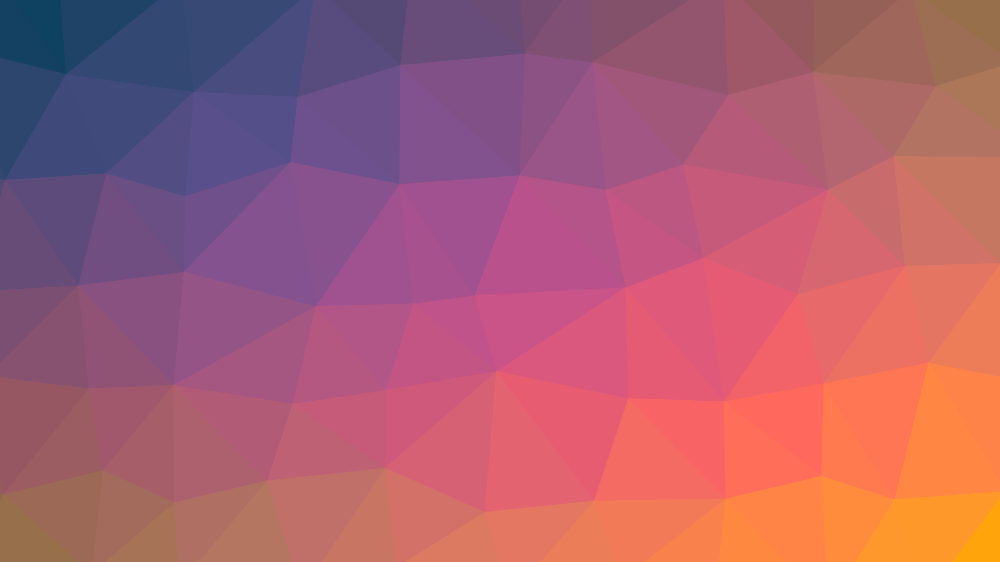

---

title: "Expressions and Control Flow"
description: ""
marp: true
theme: rhea
color: "dark-gray"
size: 16:9

---

<!--
paginate: true
 -->
<!-- 
_footer: ''
_paginate: false
 -->
<!-- _class: lead -->
# Expressions and Control Flow



---

## Overview


Ultimately, coding is **expression**.

It shouldn't be surprising that control flow is also just an **expression**.

---

<!-- header: ' '-->

## Expressions are declarative

Expressions declare calculations to be performed.

````rust tag:playground-button playground-before:$"fn main() { let vals = [1,2,3,4,5,6,7];"$ playground-after:$";}"$
vals[3] + u8::min(5, 6)
````

<div data-marpit-fragment>

An expression can be suppressed via `;`.
This can be used to bind a value to a name ([`let`](keyword:let)):

````rust tag:playground-button playground-before:$"fn main() { let vals = [1,2,3,4,5,6,7];"$ playground-after:$";}"$
let a = vals[3] + u8::min(5, 6);
````

</div>

---

## Statements are imperative

Statements specify actions to be performed.

Statement:
````rust
*GLOBAL_HANDLE.lock().unwrap() = Some(handle);
````

Assignments (via [`let`](keyword:let) or like above) really are re-bindings of new values to existing bindings.

---

## Declarative vs. Imperative

The machine ultimately is _state_ ful.
Expressions are more abstract than statements.
The compilers job is to turn abstract expressions into statements.

Expressions are a way to declaratively describe statements.

---

## Statement or Expression?

Why is `++` not a thing in Rust?

````rust tag:playground-button playground-wrap:main
let mut age = 4;
age++;
````

<div data-marpit-fragment>

`++` is both an expression (evaluates) and a statement (has an effect).
Execution order is unspecified in pathological cases (`c++ + c++`).

</div>

---

## Statements

There are only few actual statements:

````rust tag:playground-button playground-wrap:main
let mut a = 4;
a += 3;
fn reset(counter: &mut i32) {
    *counter = 0;
}
````

<div data-marpit-fragment>

Functional languages have generally only expressions. Rust strikes a balance here between conceptional purity and being honest about what's happening.

</div>

<!-- calling a mutating function of course can be considered a statement -->

---

## Expressions in blocks

A block can be used to group expressions.

````rust tag:playground-button playground-wrap:main
let a = { 5 };
````

<div data-marpit-fragment>

A block with a sequence of "statements" evaluates to the value of the last expression in it:

````rust tag:playground-button playground-before:$"fn main() {"$ playground-after:$"dbg!(a);}"$
let a = {
    let a = 1 + 2;
    let b = a + a;
    b
};
````

</div>

---

## Expressions of type [`()`](https://doc.rust-lang.org/std/primitive.unit.html#)

When empty, or when terminated by a `;`, the type of a block will be [`()`](https://doc.rust-lang.org/std/primitive.unit.html#).

````rust tag:playground-button playground-wrap:main
{ };
{ 5; };
{ println!("println returns `()`") };
````

---

## "Special Blocks": [`if`](keyword:if)

If-expressions can be viewed as special block expressions.

````rust tag:playground-button playground-before:$"fn main() {let a = 4;"$ playground-after:$"dbg!(value);}"$
let value = if a < 7 { "less" } else { "greater-equals" };
````

This is just like the "ternary operator", but generalized.

---

## "Special Blocks": [`if`](keyword:if)

The syntax differs quite a bit from other languages:

````c
char* value;
if (a < 7) value = "less";
else value = "greater-equals";
````

<div data-marpit-fragment>

The braces are mandatory, the parentheses are not.
<!-- try putting parentheses around the condition in the playground -->

````rust tag:playground-button playground-wrap:main
let value = if a < 7 { "less" } else { "greater-equals" };
````

</div>

---

## But, what if...

What if there was no [`else`](keyword:else)?

````rust tag:playground-button playground-before:$"fn main() {let a = 4;"$ playground-after:$"dbg!(value);}"$
let value = if a < 7 { "less" };
````

<div data-marpit-fragment>

````
error[E0317]: `if` may be missing an `else` clause
3 |       let value = if a < 7 {
  |  _________________^
4 | |         "less"
  | |         ------ found here
5 | |     };
  | |_____^ expected `&str`, found `()`
  = help: consider adding an `else` block that evaluates to the expected type
````

</div>

---

## But, what if...

What if the [`else`](keyword:else) branch **diverges**?

````rust tag:playground-button playground-before:$"fn main() {let a = 4;"$ playground-after:$"dbg!(value);}"$
let value = if a < 7 {
    "less"
} else {
    std::process::exit(1);
};
````

The [`Never Type`](rust:std::convert::Infallible) is the secret sauce here.
It's the only subtype that exists (it can become any other type).

---

## "Special Blocks": [`match`](keyword:match)

Say you have this enumeration:

````rust tag:playground-button playground-wrap:main
enum PageEvent {
    Load,
    KeyPress(char),
    Paste(String),
    Click { x: i64, y: i64 },
}
````

How would you match its patterns?

---

## "Special Blocks": [`match`](keyword:match)

[`match`](keyword:match) on it!

````rust tag:playground-button playground-before:$" enum PageEvent { Load, KeyPress(char), Paste(String), Click { x: i64, y: i64 }, }fn main(){ "$ playground-after:$"}"$
impl PageEvent {
    pub fn show(&self) -> String {
        match self {
            PageEvent::Load => "Page loaded".to_string(),
            PageEvent::KeyPress(c) => format!("Key {c} pressed"),
            PageEvent::Paste(content) => format!("Pasted content {content}"),
            PageEvent::Click { x, y } => format!("Clicked at (x: {x}, y: {y})"),
        }
    }
}
````

---

## Match as a generalized `else-if` chain

An else-if can kind-of sub for a match, but really match is so much cooler.

````rust tag:playground-button playground-wrap:main
let small = 2;
let text = match small {
    1 => "one",
    2 => "two",
    3..=5 => "several",
    n if n < 100 => "lots...",
    _ => "so many!",
};
````

---

## Specialized [`match`](keyword:match): `if let`

Sometimes, just one pattern is interesting.

````rust tag:playground-button playground-wrap:main
if let Err(e) = std::fs::read_to_string("nothing.txt") {
    eprintln!("Error reading nothing: {e:?}");
}
````

This comes in particularly handy with error handling.

---

## Even more specialized [`match`](keyword:match): `let else`

Some patterns are **refutable**, others are **irrefutable**.

To process the content of a **refutable** pattern and diverge otherwise, use a `let-else`:

````rust tag:playground-button playground-wrap:main
let GeoJson::FeatureCollection(features) = geojson else {
    return Err(format_err_status!(
        422,
        "GeoJSON was not a Feature Collection",
    ));
};
````

---

## Even more specialized [`match`](keyword:match): `let else`

Particularly handy when processing enums or options in parser- and compiler-like programs:

````rust
pub fn div(val: Value, _env: &mut Environment) -> Result<Value, anyhow::Error> {
    let Value::Sexpr(s) = val else {
        return Err(anyhow::anyhow!("non-sexpr passed to 'div'"));
    };
    s.div()
}
````

<!-- _footer: '[barafael/pils](https://github.com/barafael/pils)' -->

---

## "Special Blocks": [`loop`](keyword:loop)

It's nothing surprising:

````rust tag:playground-button playground-wrap:main
let values = [1, 3, 4, 8];
let mut index = 0;

loop {
    println!("{}", values[index]);
    index += 1;
    if index == values.len() {
        break;
    }
}
````

---

## "Special Blocks": Iterators preview

Somewhat beyond "Expressions and Control Flow":

````rust tag:playground-button playground-wrap:main
[1, 3, 4, 8].for_each(|elem| println!("{elem}"));
````

`|e| e.process()` is just a closure.

<!-- _footer: 'We'll see way more of that later' -->

---

## "Special Blocks": [`loop`](keyword:loop)

[Breaking](keyword:break) from a loop makes that the value of the loop block:

````rust tag:playground-button playground-wrap:main
let end = loop {
    let value = do_thing();
    if end_condition() {
        break value;
    }
};
````

---

## "Special Blocks": [`loop`](keyword:loop)

In a function returning `Ok(())` or `Err(...)`

````rust marker:break_loop_with_value

````

---

## "Special Blocks": [`loop`](keyword:loop)

The [`Never Type`](rust:std::convert::Infallible) strikes again:

````rust tag:playground-button playground-wrap:main_anyhow
let end = loop {
    let value = do_thing();
    if end_condition() {
        break value;
    }
    if final_condition() {
        anyhow::bail!("Error occurred");
    }
};
````

---

## "Special Blocks": [`for`](keyword:for)

Of course, [`for`](keyword:for)-style loops are a thing:

````rust tag:playground-button playground-wrap:main
let values = [1, 3, 4, 8];
for value in values {
    println!("{value}");
}
````

---

## "Special Blocks": [`while`](keyword:while)

A while loop isn't particularly exciting:

````rust tag:playground-button playground-wrap:main
while !*quit {
    info!("Waiting for quit of midi connection");
    quit = cvar.wait(quit).unwrap();
}
````

Rarely used like this, surprisingly.

---

## Specialized [`while`](keyword:while): `while let`

````rust tag:playground-button playground-before:$" enum PageEvent { Load, KeyPress(char), Paste(String), Click { x: i64, y: i64 }, }fn main(){    let mut page = vec![PageEvent::Load, PageEvent::KeyPress('a'), PageEvent::Paste(String::from("clipboard content")), PageEvent::Click { x: 10, y: 20 }].into_iter(); "$ playground-after:$"}"$
while let Some(e) = page.next() {
    let event = match e {
        PageEvent::Load => "Page loaded".to_string(),
        PageEvent::KeyPress(c) => format!("Key {c} pressed"),
        PageEvent::Paste(content) => format!("Pasted content {content}"),
        PageEvent::Click { x, y } => format!("Clicked at (x: {x}, y: {y})"),
    };
    println!("Event: {event}");
}
````

---

## "Special Blocks": [`Functions`](keyword:fn)

A function can be seen as a special kind of block:

````rust tag:playground-button
fn random() -> u32 {
    4 // chosen by fair dice roll.
      // guaranteed to be random.
}
````

---

## "Special Blocks": [`Functions`](keyword:fn)

Omitting the return type makes the function return `()`, called "Unit":

````rust tag:playground-button playground-wrap:main
fn trigger(level: u8) {
    // ...
}
let result: () = trigger(12);
````

---

## "Special Blocks": [`Functions`](keyword:fn)

Special return type: [`std::convert::Infallible`](rust:std::convert::Infallible)

````rust tag:playground-button
fn main() -> ! {
    loop {
        let input = read_input().await;
        dbg!(input);
    }
}
````

---

## The `main` function

````rust tag:playground-button
use anyhow::Context;
fn main() -> anyhow::Result<()> {
    "blergh".parse::<u32>().context("Not feeling it today")?;
    Err(anyhow::anyhow!("Nah..."))
}
````

`main` must return a type that is a [`Termination`](https://doc.rust-lang.org/std/process/trait.Termination.html#implementors).

Examples: [`()`](https://doc.rust-lang.org/std/primitive.unit.html), [`!`](rust:std::convert::Infallible), [`ExitCode`](rust:std::process::ExitCode), and [`Result<T, E>`](rust:std::result::Result)

---

## Aside: Closures

The combinators seen earlier compose:

````rust tag:playground-button playground-wrap:main
[1, 3, -4, 8, 0]
    .into_iter()
    .map(i32::signum)
    .inspect(|sign| println!("{sign}"))
    .sum::<i32>();
````

---

## Aside: Closures

Equivalent, but less nice:

````rust tag:playground-button playground-wrap:main
[1, 3, -4, 8, 0]
    .into_iter()
    .map(|elem| elem.signum())
    .inspect(|sign| {
        println!("{sign}");
    })
    .sum::<i32>();
````

---

## Expression Orientation

These are perfectly fine snippets:

````rust tag:playground-button playground-wrap:main
let value = if 'C'.is_uppercase() { 5 } else { 8 };

let next = match value {
    5 => 6,
    8 => 9,
    n if n % 2 == 0 => n + 1,
    _ => -1,
};
````

---

## Expression Orientation

Wrap expressions in other expressions:

````rust tag:playground-button playground-wrap:main
fn next_value(previous: i32) -> i32 {
    match previous {
        5 => 6,
        8 => 9,
        n if n % 2 == 0 => n + 1,
        _ => -1,
    }
}
````

---

## Review

.png)

- Expressions can be used anywhere
- `if`, `loop`, and `match` are  also just expressions
- `if let`, `let-else`, `while let`, ...
- Function bodies are one large expression
- Control flow and expressions are intertwined

---

## Questions?

<iframe style="margin-top:5%" width="100%" height="80%" src="https://play.rust-lang.org/?version=stable&mode=debug&edition=2021&code=fn+main%28%29+%7B%7D%0A">
</iframe>
