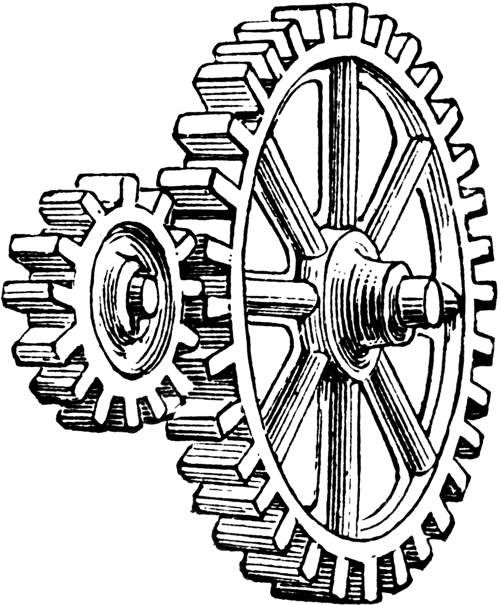

---

title: "Data and Structure"
description: ""
marp: true
theme: rhea
color: "dark-gray"
size: 16:9

---

<!--
paginate: true
 -->
<!-- 
_footer: ''
_paginate: false
 -->
<!-- _class: lead -->

# Data and Structure

## Language Basics: How to structure data


---

## Overview


"All of these things": [`struct`](keyword:struct)

"Any of these things": [`enum`](keyword:enum)

And that's it!

Of course, there are implications; construction, deconstruction, pattern matching, size/alignment/padding

---

<!-- header: ' '-->

## [`struct`](keyword:struct)s ("Product Types")

A [`struct`](keyword:struct) is just a "Plain Old Data" type. Not a class.
It is comprised of **members**.

````rust tag:playground-button
struct Message {
    from: Option<String>,
    to: String,
    content: String,
}
````

---

## Con[`struct`](keyword:struct)ion

There is only one way to initialize a [`struct`](keyword:struct).
Looks a little like a C++ initializer list:

````rust tag:playground-button playground-before:$"struct Message { from: Option<String>, to: String, content: String, }fn main() {"$ playground-after:$"}"$
let msg = Message {
    from: None,
    to: "Bertha".to_string(),
    content: "Hey, a struct".to_string(),
};
println!("Receiver: {}", msg.to);
````

---

## Con[`struct`](keyword:struct)ion

Mutability extends to all [`struct`](keyword:struct) members (because the mutability is part of the binding).

````rust tag:playground-button playground-before:$"struct Message { from: Option<String>, to: String, content: String, }fn main() {"$ playground-after:$"}"$
let mut msg = Message {
    from: None,
    to: "Bertha".to_string(),
    content: "Hey, a struct".to_string(),
};
msg.from = Some("Nick".to_string());
````

---

## [`struct`](keyword:struct) from Standard Library: [`Duration`](rust:std::time::Duration)

A [`Duration`](rust:std::time::Duration) contains private members for seconds and nanoseconds.

The type defines constants like [`SECOND`](rust:std::time::Duration::SECOND) and functions like [`from_millis`](rust:std::time::Duration::from_secs).

Human-readable durations like "1ms" or "2 days" can be parsed to [`Duration`](rust:std::time::Duration)s using the [`humantime`](docsrs:https://docs.rs/humantime/latest/humantime/) crate.

---

## Common crates using [`Duration`](rust:std::time::Duration)

Like many types from [`std`](rust:std), [`Duration`](rust:std::time::Duration) is ubiquitously used throughout the ecosystem:

[`timeout` in tokio](docsrs:https://docs.rs/tokio/latest/tokio/time/fn.timeout.html)

[`connect_timeout` in tauri](docsrs:https://docs.rs/tauri/latest/tauri/api/http/struct.ClientBuilder.html#method.connect_timeout)

[Cursor blinking in alacritty](https://github.com/alacritty/alacritty/blob/a58fb39b68caa34b073f66911c0ac6945f56eac2/alacritty/src/event.rs#L1017C1-L1019C1)

[`with_timeout` in simple-tokio-watchdog](https://docs.rs/simple-tokio-watchdog/0.2.0/simple_tokio_watchdog/struct.Watchdog.html#method.with_timeout)

[More on GH Code Search](https://github.com/search?type=code&auto_enroll=true&q=Duration%3A%3A+language%3ARust)

---

## Example from Standard Library: [`Vec<T>`](rust:std::vec::Vec)

A [`Vec<T>`](rust:std::vec::Vec) is like a C++ _std::vector<T>_ or Java _ArrayList<T>_.

The API is slightly different, but the idea is the same.

````rust tag:playground-button
pub struct Vec<T> {
    ptr: NonNull<T>,
    cap: usize,
    len: usize,
}
````

---

## How to print the entire [`struct`](keyword:struct)?

Well, just use [`println!`](rust:std::println)?

````rust tag:playground-button playground-before:$"struct Message { from: Option<String>, to: String, content: String, }fn main() {"$ playground-after:$"}"$
let msg = Message {
    from: None,
    to: "Bertha".to_string(),
    content: "Hey, a struct".to_string(),
};
println!("{msg}");
````

---

## How to print the entire [`struct`](keyword:struct)?

````rust tag:playground-button playground-before:$"struct Message { from: Option<String>, to: String, content: String, }fn main() {"$ playground-after:$"}"$
let msg = Message {
    from: None,
    to: "Bertha".to_string(),
    content: "Hey, a struct".to_string(),
};
println!("{msg}");
````

````
error[E0277]: `Message` doesn't implement `std::fmt::Display`
  --> src/main.rs:12:15
   |
12 |     println!("{msg}");
   |               ^^^^^ `Message` cannot be formatted with the default formatter
   |
   = help: the trait `std::fmt::Display` is not implemented for `Message`
   = note: in format strings you may be able to use `{:?}` (or {:#?} for pretty-print) instead
````

---

## Trying to print a [`struct`](keyword:struct) with `:?`

````rust tag:playground-button playground-before:$"struct Message { from: Option<String>, to: String, content: String, }fn main() {"$ playground-after:$"}"$
let msg = Message {
    from: None,
    to: "Bertha".to_string(),
    content: "Hey, a struct".to_string(),
};
println!("{msg:?}");
````

---

## Arghh why is this so hard

````
error[E0277]: `Message` doesn't implement `Debug`
  --> src/main.rs:12:15
   |
12 |     println!("{msg:?}");
   |               ^^^^^^^ `Message` cannot be formatted using `{:?}`
   |
   = help: the trait `Debug` is not implemented for `Message`
   = note: add `#[derive(Debug)]` to `Message` or manually `impl Debug for Message`
   = note: ...
help: consider annotating `Message` with `#[derive(Debug)]`
   |
1  + #[derive(Debug)]
2  | struct Message {
   |
````

---

## Just `derive` it!

A `derive` may be used to extend a type with a derivable [`trait`](keyword:trait) -
more on this later.

````rust
#[derive(Debug)]
struct Message {
    from: Option<String>,
    to: String,
    content: String,
}
````

---

## Now printing is easy, finally

````rust tag:playground-button playground-before:$"#[derive(Debug)] struct Message { from: Option<String>, to: String, content: String, }fn main() {"$ playground-after:$"}"$
let msg = Message {
    from: None,
    to: "Bertha".to_string(),
    content: "Hey, a struct".to_string(),
};
println!("{msg:#?}");
````

<!-- _footer: '`:#?` as a format string uses a pretty-printer. Normally, just use `:?`.' -->

---

## Now printing is easy, finally

````rust tag:playground-button playground-before:$"#[derive(Debug)] struct Message { from: Option<String>, to: String, content: String, }fn main() {"$ playground-after:$"}"$
let msg = Message {
    from: None,
    to: "Bertha".to_string(),
    content: "Hey, a struct".to_string(),
};
println!("{msg:#?}");
````

````
Message {
    from: None,
    to: "Bertha",
    content: "Hey, a struct",
}
````

---

## Preview: Deriving Traits

`derive`-ing just means generating Code for a type.
This code comes in the form of a [`trait`](keyword:trait) like [`Debug`](rust:std::fmt::Debug).

````rust tag:playground-button
#[derive(Debug, Clone, Hash, PartialEq, Eq, PartialOrd, Ord)]
struct Message {
    from: Option<String>,
    to: String,
    content: String,
}
````

The Rust API guidelines recommend [eagerly deriving common traits](https://rust-lang.github.io/api-guidelines/interoperability.html#types-eagerly-implement-common-traits-c-common-traits).

<!-- _footer: 'Some raits like [`Default`](rust:Default) are derivable but may not make sense (like above).' -->

---

## Now what about that [`std::fmt::Display`](rust:std::fmt::Display)?

Customize user-facing type display:

````rust tag:playground-button playground-before:$"#[derive(Debug)] struct Message { from: Option<String>, to: String, content: String, }"$
impl std::fmt::Display for Message {
    fn fmt(&self, f: &mut std::fmt::Formatter<'_>) -> std::fmt::Result {
        let from = self.from.as_ref().map(String::as_str).unwrap_or("nobody");
        write!(
            f,
            "Message from '{}' to '{}': '{}'",
            from, self.to, self.content
        )
    }
}
````

---

## Now what about that [`std::fmt::Display`](rust:std::fmt::Display)?

Customize user-facing type display:

````rust tag:playground-button playground-before:$"#[derive(Debug)] struct Message { from: Option<String>, to: String, content: String, } impl std::fmt::Display for Message { fn fmt(&self, f: &mut std::fmt::Formatter<'_>) -> std::fmt::Result { let from = self.from.as_ref().map(String::as_str).unwrap_or("nobody"); write!( f, "Message from '{}' to '{}': '{}'", from, self.to, self.content) } }fn main() {"$ playground-after:$"}"$
println!(
    "{}",
    Message {
        from: Some("Alice".to_string()),
        to: "Bob".to_string(),
        content: "In a bottle".to_string(),
    }
);
````

---

## Tuple Struct (unnamed members)

Sometimes, it is not necessary/possible to give the members good names.

````rust tag:playground-button
struct Version(u32, u32, u32);
````

Realistic example: [`SendError<T>`](rust:std::sync::mpsc::SendError)

In reality, this is rare on it's own (but we'll see why it exists).

---

## Unit Struct (no members)

Just an empty struct.

````rust tag:playground-button
struct StatelessCodec;
````

Sometimes a unique type is required but it has no meaningful members.

---

## [`Elapsed`](docsrs:https://docs.rs/tokio/latest/tokio/time/error/struct.Elapsed.html) empty tuple struct

````rust
pub struct Elapsed(());
````

The struct [](docsrs:https://docs.rs/tokio/latest/tokio/time/error/struct.Elapsed.html) has no ([`pub`](keyword:pub)) members. This prevents manual construction, leaving it open for the future at no cost.

<!-- _footer: '[Elapsed in tokio](https://docs.rs/tokio/latest/src/tokio/time/error.rs.html#48)' -->

---

## Now, what is a Product Type?

The number of different values is the product of the number of different values of each member.

````rust
(): 1 possible value
bool: 2 possible different values
u8: 256 possible different values

struct Bunch((), bool, u8): 1 * 2 * 256 = 512 values
````

---

## Size of a [`struct`](keyword:struct)

For a product type, the size in bytes is the sum of the sizes of the members.

````rust tag:playground-button playground-before:$"struct Bunch((), bool, u8); fn main() {"$ playground-after:$"}"$
println!("{}", std::mem::size_of::<Bunch>());
````

This is true for member-less [`struct`](keyword:struct)s too:

````rust tag:playground-button playground-before:$"struct StatelessCodec; fn main() {"$ playground-after:$"}"$
println!("{}", std::mem::size_of::<StatelessCodec>());
````

---

## Memory Layout, Alignment and Padding

Rust **does not** have a stable ABI. The compiler is free to determine the memory layout of [`struct`](keyword:struct) members as it pleases. It may align the members, or sort the members by size, for least padding.

To manually influence the binary layout of a [`struct`](keyword:struct):

````rust marker:simple_badly_aligned_reprc_struct

````

<div data-marpit-fragment>

<table style="width:100%; table-layout: fixed; text-align: center">
    <tr>
        <td><code>u8</code>     </td>
        <td><code>u8</code>     </td>
        <td><code>d/c</code>    </td>
        <td><code>d/c</code>    </td>
        <td><code>u32[0]</code> </td>
        <td><code>u32[1]</code> </td>
        <td><code>u32[2]</code> </td>
        <td><code>u32[3]</code> </td>
    </tr>
</table>

</div>

---

## Memory Layout, Alignment and Padding

````rust marker:print_meta

````

<div data-marpit-fragment>

This prints:

````
type name: to_byte_slice::tests::badly_aligned_struct::A,
len: 8,
bytes: 1, 2, 0, 0, 4, 0, 0, 0
````

We see that 2 bytes of padding were added, and the members are in order of definition.

</div>

<!-- _footer: 'Note that relying on struct layout in C is very questionable' -->

---

## Packed Structs

You can **pack** [`struct`](keyword:struct) members, of course.

````rust marker:simple_badly_aligned_reprpacked_struct

````

<div data-marpit-fragment>


<table style="width:100%; table-layout: fixed; text-align: center">
    <tr>
        <td><code>u8</code>     </td>
        <td><code>u8</code>     </td>
        <td><code>u32[0]</code> </td>
        <td><code>u32[1]</code> </td>
        <td><code>u32[2]</code> </td>
        <td><code>u32[3]</code> </td>
    </tr>
</table>

</div>

---

## Packed Structs

````rust marker:print_meta_packed

````

---

## Packed Structs

````rust marker:print_meta_packed

````

This prints:

````
type name: to_byte_slice::tests::badly_aligned_struct_packed::A,
len: 6,
bytes: 1, 2, 4, 0, 0, 0
````

---


## Is there also a Sum Type then?

An [`enum`](keyword:enum) is a type with a number of variants.
Each variant carries data.
The [`enum`](keyword:enum) is exactly one variant at any time.

````rust tag:playground-button
enum Event {
    Reload,
    Shoot {
        x: u32,
        y: u32,
    },
    Mana(f32),
}
````

<!-- _footer: 'In the binary, this looks like a "discriminated union" in C (we'll see).' -->

---

## What does "Sum Type" mean?

The syntax in the variants is exactly like the syntax for [`struct`](keyword:struct)s - that's no coincidence.

````rust
(): 1 possible value
bool: 2 possible different values
u8: 256 possible different values

// 1 + 2 + 256 possible different values
enum Any {
    Unit,
    Boolean(bool),
    Byte(u8),
}
````

---

## Example from Standard Library: [`ErrorKind`](rust:std::io::ErrorKind)

````rust
#[non_exhaustive]
pub enum ErrorKind {
    NotFound,
    PermissionDenied,
    ConnectionRefused,
    ConnectionReset,
    HostUnreachable,
...
````

Functions like [`TcpStream::connect`](rust:std::net::TcpStream::connect) return [`io::Error`](rust:std::io::Error), which wraps an [`ErrorKind`](rust:std::io::ErrorKind).

---

## Example: `Maybe<T>` type

Simple type borrowed from Haskell land:

````rust marker:enum_type_maybe

````

This type signifies a value that may or may not be present.
Don't mind the generic `T`.

---

## How can we get at the data?

Destructuring data in the simple 2-case distinction:

````rust marker:maybe_type_iflet

````

---

## How can we get at the data?

For [`enum`](keyword:enum)s with more variants, it's more complex:

````rust marker:enum_type_maybe_match

````

This is an exhaustive match over patterns.
These patterns are just like in our chapter about [`let`](keyword:let).

---

## Deriving traits on enums

Maybe a bit too much, but it's a realistic example.
Note that [`clap::ValueEnum`](docsrs:https://docs.rs/clap/latest/clap/trait.ValueEnum.html) is defined in a foreign crate!

````rust
#[derive(
    clap::ValueEnum, PartialEq, Eq, PartialOrd, Clone, Copy, Debug, Serialize, Deserialize, Default,
)]
pub enum Level {
    Trace = 0,
    Debug,
    #[default]
    Info,
    Warn,
    Error,
    Critical,
    Off,
}
````

<!--
_footer: 'From: [Level](https://github.com/microsoft/vscode/blob/6b9583d2dc4140e0db51d8037643e5ce8763cb0c/cli/src/log.rs#L29C1-L41) in the 0.9% of VSCode that are written in Rust' -->

---

## Memberless Enum?

In the same way where a member-less [`struct`](keyword:struct) has exactly one possible value isomorphic to `()`, a variant-less [`enum`](keyword:enum) has **no** possible value.

````rust tag:playground-button playground-wrap:main
enum Impossible {}
//let x = Impossible::?;
assert_eq!(0, std::mem::size_of::<Impossible>());
````

This fact is exploited by [`Infallible`](rust:std::convert::Infallible): it is an un-instantiable type.

<!-- _footer: '1: neutral element of multiplication, 0: neutral element of summation' -->

---

## Size of an [`enum`](keyword:enum)

An [`enum`](keyword:enum) needs space to store the **discriminant**: the value that marks the valid variant. The size of the **discriminant** depends on the number of variants of the [`enum`](keyword:enum).

**Add**itionally, the [`enum`](keyword:enum) must have space to store the (aligned) data for the largest variant.

````rust marker:maybe_type_enum_sizes

````

---

## Wait - how could a `Maybe<bool>` be 1 byte?

A single byte containing both bool values and the marker? Yep!

Why is this special? Well, it means that the compiler must peer into [`bool`](keyword:bool) to find the possible bit patterns.

This is called "niche optimization" and is crucial.

````rust marker:maybe_type_size_of_references

````

---

## Wait - how could a `Maybe<bool>` be 1 byte?

A single byte containing both bool values and the marker? Yep!

Why is this special? Well, it means that the compiler must peer into [`bool`](keyword:bool) to find the possible bit patterns.

This is called "niche optimization" and is crucial.

````rust marker:maybe_type_size_of_boxes

````

---

## C-Like Null-Checking APIs

````cpp
char* x = get_item(12);
if (x == nullptr) {
    return -1;
}
````

Equivalent to:

````rust
fn get_item(i32) -> Option<Box<i32>>;
let x = get_item(12);
if x.is_none() {
    return -1;
}
````

<!-- _footer: 'This is NOT idiomatic rust!' -->

---

## C-Like Null-Checking APIs

````cpp
char* x = get_item(12);
if (x == nullptr) {
    return -1;
}
````

Equivalent to:

````rust
fn get_item(i32) -> Option<Box<i32>>;
let x = match get_item(12) {
    Some(x) => x,
    None => return -1,
};
````

<!-- _footer: 'Still not completely idiomatic rust!' -->

---

## C-Like Null-Checking APIs

````cpp
char* x = get_item(12);
if (x == nullptr) {
    return -1;
}
````

Equivalent to:

````rust
fn get_item(i32) -> Option<Box<i32>>;
let Some(x) = get_item(12) else {
    return -1;
}
````

---

## How does a Sum Type look in C?

Let's examine this enum:

````rust marker:disc_union_enum

````

<!-- _footer: 'Inspired by [`serde_json::Value`](https://docs.rs/serde_json/1.0.106/serde_json/enum.Value.html)'-->

---

## C Tag Enum

Let's [mozilla/cbindgen](https://github.com/mozilla/cbindgen) to look at the C representation.
The generated "Tag Enum":

````c marker:disc_union_tag_enum

````

Note that C enums are simply global integers with compiler-assigned values.

---

## C Struct `Value`

The wrapping `struct` with the "tag" and "union":

````c
typedef struct Value {
  Value_Tag tag;
  union {
    struct {
      bool bool_;
    };
    // ...
  };
} Value;
````

---

## Review



<style scoped>
li {
    font-size: 30px;
}
</style>

- structs collect members
- enums discern variants
- For printing, just derive Debug
- Memory Layout is pretty minimal:
  - structs look like dense C structs
  - enums look like C tagged unions
  - Some types have size 0!

---

## Questions?

<jframe style="margin-top:5%" width="100%" height="80%" src="https://play.rust-lang.org/?version=stable&mode=debug&edition=2021&code=fn+main%28%29+%7B%7D%0A">
</iframe>
