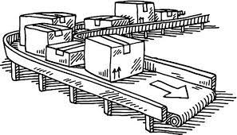
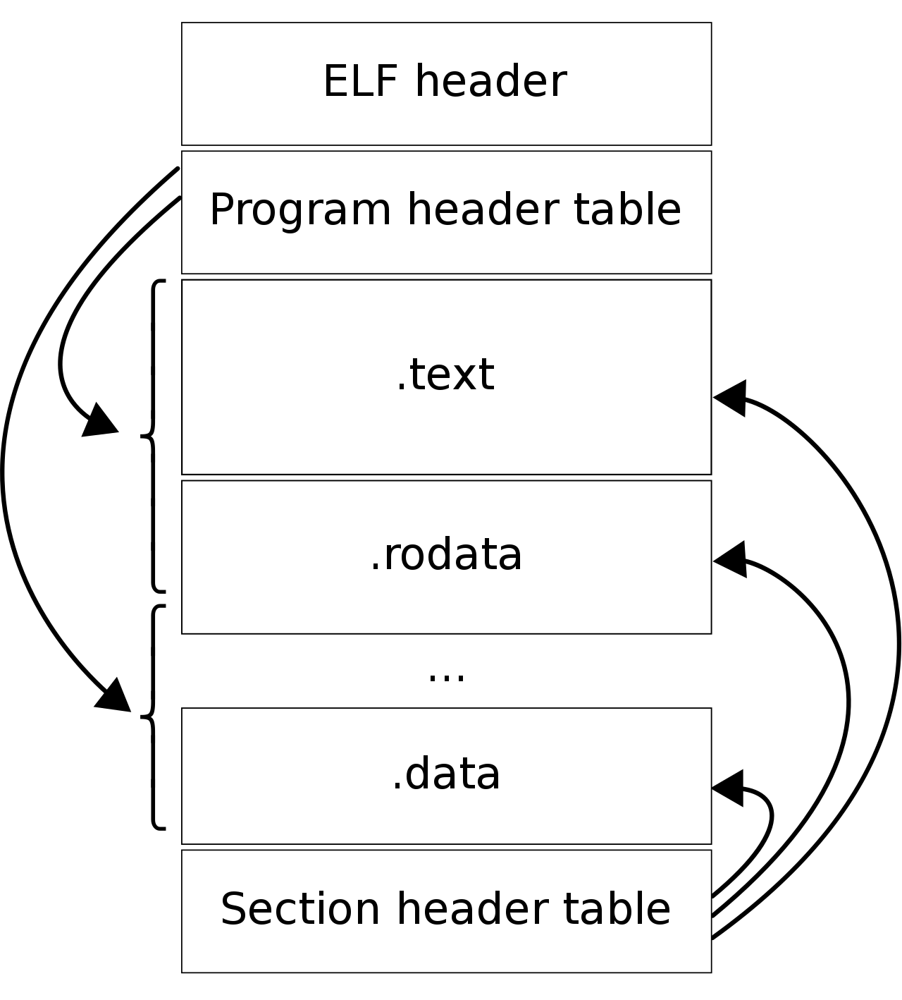

---

title: "Move Semantics"
description: "A sensible default"
marp: true
theme: rhea
color: ""
size: 16:9

---

<!--
paginate: true
 -->
<!-- 
_footer: ''
_paginate: false
 -->
<!-- _class: lead -->

# Move Semantics & Ownership

## Sensible Defaults


---

## Overview



Move Semantics and Ownership:
Ideas at the core of Rust

Implications for

 - API design
 - Memory and Resource Management
 - Performance

---

<!-- header: ' '-->

## Ownership

**Owning** a resource (file, reference, mutex) means:
- Power to **move** (transfer) this resource to others
- Power to **borrow** (share) this resource with others
- Obligation to eventually **drop** (clean up) the resource

Every value in Rust has exactly one owner at any point in time.

````rust tag:playground-button playground-wrap:main
let owner = vec![1, 2, 3, 4];
````

---

## Moving Ownership

Ownership can transfer using a **Move**. Guess the output:
````rust tag:playground-button playground-before:$"fn main() { #[derive(Debug, Default)] struct Thing;"$ playground-after:$"}"$
let thing = Thing::default(); // `thing` holds a value of type `Thing`.
let new_owner = thing; // Ownership of the value moves to `new_owner`.
println!("{thing:?}");
````

<div data-marpit-fragment>

````
error[E0382]: borrow of moved value: `thing`
4 |     let owner = Thing::default(); // `thing` holds a value of type `Thing`.
  |         ----- move occurs because `thing` has type `Thing`, which does not implement the `Copy` trait
5 |     let new_owner = thing; // Ownership of the value moves to `new_owner`.
  |                     ----- value moved here
6 |     println!("{thing:?}");
  |               ^^^^^^^^^ value borrowed here after move
````

</div>

---

## Move Semantics

````rust tag:playground-button playground-wrap:main
type Dough = Vec<String>;

#[derive(Debug)]
enum Baked {
    Cake,
    Bread,
}

fn bake(d: Dough) -> Baked {
    if d.iter().any(|e| e == "egg") {
        Baked::Cake
    } else {
        Baked::Bread
    }
}
````

<!-- here, bake takes a dough and consumes it, producing something new -->

<!-- pass by move -->

---

## Move Semantics in function signatures

Functions can take arguments by-value (by-move):

````rust tag:playground-button playground-wrap
fn takes_vec(handles: Vec<JoinHandle>) -> Result<(), JoinError> {
    handles
        .into_iter()
        .map(JoinHandle::join)
        .collect::<Result<Vec<_>, JoinError>>()
        .map(drop)
}
````

How many bytes will be moved here?

---

## Strict APIs with "Pass-by-Move"

This API is (maybe a little too) strict:

````rust tag:playground-button
fn uppercase(s: String) -> String {
    s.chars().map(|c| c.to_uppercase().to_string()).collect::<String>()
}
````

<div data-marpit-fragment>

However, the API is quite "honest": uppercasing may require (re-)allocation (ß -> SS).
This function always deallocates, then allocates.
It's an opinionated interface!

</div>

---

## Processing a `Qexpr` with Move Semantics

````rust tag:playground-button
#[derive(Debug, Clone, PartialEq, Deserialize, Serialize)]
pub struct Qexpr(pub(crate) VecDeque<Value>);

impl Qexpr {
    pub fn into_sexpr(self) -> Sexpr {
        Sexpr(self.0)
    }

    pub fn head(mut self) -> Result<Value, anyhow::Error> {
        self.0.pop_front().context("'head' on empty qexpr")
    }
}
````

<!-- _footer: 'From: [pils](https://github.com/barafael/pils), demo at [https://barafael.github.io/pils/](https://barafael.github.io/pils/)' -->

---

## Unwrapping a `Maybe`

Some method implementations require taking a `self`:

````rust marker:maybe_fn_once

````

---

## Mutex and Guard containing data

A simple mutex that **owns** its data:

````rust marker:simple_mutex

````

The data can only be mutated through the guard, which is limited by a lifetime.
When the guard is dropped, the mutex [is released](https://doc.rust-lang.org/src/std/sync/mutex.rs.html#530-538).

---

## Speaking of drop: [`std::mem::drop`](rust:std::mem::drop)

To **drop** a value means to "run its destructor" and clean it up.
To use it, call the freestanding function [`drop`](rust:std::mem::drop):

````rust tag:playground-button
#[inline]
pub fn drop<T>(_x: T) {}
````

This is arguably the nicest function in [rust:std], or ever!

<!-- _footer: 'See [parametricity](https://en.wikipedia.org/wiki/Parametricity)' -->

---

## What is this `Copy` thing?

This message from earlier:

````
  |         ----- move occurs because `thing` has type `Thing`, which does not implement the `Copy` trait
5 |     let new_owner = thing; // Ownership of the value moves to `new_owner`.
  |                     ----- value moved here
````

hints that `Copy` can bypass move semantics.

---

## Preview: The [`Copy`](https://doc.rust-lang.org/std/marker/trait.Copy.html) Marker

The trait [`Copy`](https://doc.rust-lang.org/std/marker/trait.Copy.html) marks a type which can trivially be copied bit-wise.
Moving a `Copy` value leaves the original intact:

````rust tag:playground-button playground-wrap:main
let now = std::time::Instant::now();
let now_too = now;
println!("{now:?}");
````

<div data-marpit-fragment>

[Implementors](https://doc.rust-lang.org/std/marker/trait.Copy.html#implementors) of [`Copy`](https://doc.rust-lang.org/std/marker/trait.Copy.html) include the basic scalar types, [`AsciiChar`](rust:std::ascii::Char), [`IpAddr`](rust:std::net::IpAddr), [`SocketAddr`](rust:std::net::SocketAddr), [`ExitCode`](rust:std::process::ExitCode), [`Instant`](rust:std::time::Instant), ...

</div>

---

## Rebinding/Shadowing

Sometimes, ownership is moved from binding to binding:

````rust tag:playground-button playground-wrap:main
let name = "file.md";
let name = name.trim_end_matches(".md");
dbg!(name);
````

Advantage: the old binding becomes unusable.

---

## Rebinding/Shadowing

From [rust-lang/rust `librustdoc`](https://github.com/rust-lang/rust/blob/177091258c039398d30137b52e1c575a98aa7597/src/librustdoc/clean/types.rs#L172):

````rust tag:playground-button
fn to_remote(url: impl ToString) -> ExternalLocation {
    let mut url = url.to_string();
    if !url.ends_with('/') {
        url.push('/');
    }
    Remote(url)
}
````

<!-- _footer: another example from [facebook/sapling](https://github.com/facebook/sapling/blob/2ab9856d9478aa996ce9ba892c0d1dc347a6f3bb/eden/scm/lib/minibench/src/lib.rs#L50) -->

---

## Rebinding/Shadowing

````rust
loop {
    let (mut socket, addr) = listener
        .accept()
        .await
        .context("Failed to accept on socket")?;
    let tx = tx.clone();
    tokio::spawn(async move {
        let (reader, writer) = socket.split();
        collector::handle_connection(addr.to_string(), reader, writer, tx)
            .await
            .expect("Failed to handle connection");
    });
}
````

<!-- _footer: 'From [barafael/achat `collector`](https://github.com/barafael/achat/blob/f8b5ddf7879cc812734d29a4e666269743e89401/src/bin/collector.rs#L22-L36)' -->

---

## Ownership and Destructuring

Destructuring patterns **move out** of the target:

````rust tag:playground-button playground-before:$"type Shovel = String; type Sword = String; type Substance = String;#[derive(Debug, Default)]struct Item { shovel: Shovel, sword: Sword, medicine: Vec<Substance>, } fn main() {let item = Item::default();"$ playground-after:$"}"$
let Item { shovel, sword, .. } = item;
let Item { medicine, .. } = item;
````

---

## Ownership and Destructuring

Destructuring patterns **move out** of the target:

````rust tag:playground-button playground-before:$"type Shovel = String; type Sword = String; type Substance = String;#[derive(Debug, Default)]struct Item { shovel: Shovel, sword: Sword, medicine: Vec<Substance>, } fn main() {let item = Item::default();"$ playground-after:$"}"$
let Item { shovel, sword, .. } = item;
let Item { medicine, .. } = item;
dbg!(item);
````

<div data-marpit-fragment>

````
error[E0382]: use of partially moved value: `item`
  --> src/main.rs:14:10
   |
13 |     let Item { medicine, .. } = item;
   |                -------- value partially moved here
14 |     dbg!(item);
   |          ^^^^ value used here after partial move
````

</div>

---

## Producing [`impl`](keyword:impl)-Blocks

Methods can be defined to produce an instance of their [`Self`](keyword:Self):

````rust marker:traffic_light_default

````

<!-- _footer: 'The phantomdata marker is just a zero-sized type marker' -->

---

## Consuming [`impl`](keyword:impl)-Blocks

Methods can be defined to consume an instance of their [`Self`](keyword:Self):

````rust marker:traffic_light_consume

````

<!-- _footer: '`self` is a `TrafficLight<Yellow>' -->

---

## Review: Ownership & Move Semantics

- Every value has an **owner**
- An owner may transfer ownership of a value (**move**)
- An owner is responsible for cleaning up (**drop**ping) the value
- Bindings, function arguments, etc. all are based on ownership and move semantics

<!-- Next, lets look at **borrowing**! -->

---

## Borrowing: Shared references

A shared reference may be created from a value by **borrowing** it:

````rust tag:playground-button playground-before:$"fn main() { #[derive(Debug, Default)] struct Thing;"$ playground-after:$"}"$
let thing = Thing::default();
let reference = &thing;
let another_reference = reference;
````

Note that shared references are [`Copy`](rust:core::marker::Copy).

---

## Borrowing: Shared references

Shared references are literally pointers with a few extra rules:

- cannot be null
- cannot be misaligned
- cannot dangle (point to deallocated resources)
- cannot be used to write
- cannot coexist with mutable references

Invariant: "Sharing XOR Mutability" at compile time.

<!-- _footer: '[barafael/errare-humanum-est](https://github.com/barafael/errare-humanum-est)' -->

---

## Sharing Data by Reference

To just inspect, a method only requires a `&self`:

````rust marker:maybe_fn

````

<!-- _footer: '`matches!` is simply a macro which takes a value and a pattern' -->

---

## Sharing Data by Reference

To just inspect, a method only requires a `&self`:

````rust marker:traffic_light_display

````

---

## Sharing Data by Reference

Shared references may be shared without limits:

````rust marker:sharing_data_with_threads

````

Here, the shared reference is copied, then moved to the new thread.

<!-- _footer: 'Lifetimes play a role here, though.' -->

---

## Blanket impls which enable sharing

Shared references to any unconstrained `T` are marked [`Copy`](rust:std::marker::Copy):

````rust
/// Shared references can be copied, but mutable references *cannot*!
impl<T: ?Sized> Copy for &T {}
````

<!-- _footer: '[impl block in std](https://doc.rust-lang.org/src/core/marker.rs.html#499-501)' -->

---

## Blanket impls which enable sharing

Shared references to types which may be accessed from more than one thread may be moved over a thread boundary:

````rust
unsafe impl<T: Sync + ?Sized> Send for &T {}
````

<!-- _footer: '[impl block in std](https://doc.rust-lang.org/src/core/marker.rs.html#91-95)' -->

---

## Shared Global Mutable State with Atomics

Shared global mutable state is not possible, except with [`unsafe`](keyword:unsafe), or with **atomics**:

````rust tag:playground-button playground-before:$"use std::thread::spawn;use std::sync::atomic::Ordering;use std::sync::atomic::AtomicUsize;"$ playground-after:$""$
static COUNT: AtomicUsize = AtomicUsize::new(0);

fn main() {
    let t1 = spawn(|| COUNT.fetch_add(1, Ordering::SeqCst));
    let t2 = spawn(|| dbg!(COUNT.load(Ordering::SeqCst)));
    t1.join().unwrap();
    t2.join().unwrap();
}
````

<!-- Atomics provide a restricted API provided by the CPU architecture -->

<!-- _footer: 'More examples at [barafael/really-fast-buttons](https://github.com/barafael/really-fast-buttons/blob/main/RTIC-atomic/src/main.rs)' -->

---

## Borrowing and Mutation

A mutable, unique reference may be created from a value by mutably **borrowing** it:

````rust tag:playground-button playground-wrap:main
let mut s = String::from("some string");
let ref_x = &mut s;
s.push_str(" and another string");
````

This isn't special - it could be done without the mutable reference.
But, a mutable reference doesn't carry with it the obligation to clean up the value!

---

## Borrowing and Mutation

To [`take`](rust:std::option::Option::take) out of a `Maybe` requires mutating it, but not consuming it:

````rust marker:maybe_fn_mut

````

<div data-marpit-fragment>

[`replace`](rust:std::mem::replace) replaces the value pointed to by the first argument with the value in the second, yielding the old value.

</div>

<!-- _footer: '`&mut T` (the name) was argued over [quite a bit](https://www.reddit.com/r/rust/comments/2581s5/informal_survey_which_is_clearer_mutability_or/)' -->

---

## Borrowing and Mutation

Many functions related to sockets and buffers take mutable references:

````rust tag:playground-button playground-wrap:main
// impl Read for &TcpStream {
fn read(&mut self, buf: &mut [u8]) -> io::Result<usize> {
    self.0.read(buf)
}
````

Note that mutable references are never [`Copy`](rust:core::marker::Copy).

<!-- _footer: 'From the standard library [TcpStream](https://doc.rust-lang.org/stable/src/std/net/tcp.rs.html#656-658)' -->

---

## Borrowing and Mutation

Mutable references are literally pointers with a few extra rules:

- cannot be null
- cannot be misaligned
- cannot dangle (point to deallocated resources)
- cannot be used to write
- cannot coexist with any other reference

Invariant: "Sharing XOR Mutability" at compile time.

<!-- _footer: '[barafael/errare-humanum-est](https://github.com/barafael/errare-humanum-est)' -->

---

## Uniqueness means Mutability

Mutating a reference that is unique is obviously safe.

Mutating a reference that may be aliased from elsewhere is an obvious risk of data race.

Apart from the safety by uniqueness, it leads to pretty clear APIs.

Aliasing prevention is also [important for some optimizations](https://doc.rust-lang.org/nomicon/aliasing.html).

---

## Blanket implementations for `&mut T where T: ...`

Many operations on owned values also are made available for mutable references:

````rust
impl<A, B> PartialEq<&mut B> for &mut A
where
    A: PartialEq<B> + ?Sized,
    B: ?Sized,
````

---

## Review: Borrowing

- An owner may **borrow** a value another owner
- A **borrow** permits read-only access to many other owners
- A **mutable borrow** permits write access to exactly one owner
- A borrow does not come with the obligation (or ability) to drop a value
- A shared borrow can be moved, copied, dropped just like any other value
- A mutable borrow can be moved and dropped just like any other value

<!-- Next, lets briefly look at **lifetimes**! -->

---

## Lifetimes

Each reference has a statically known **lifetime**.
The lifetime denotes an "area" of execution where a referee exists.
Lifetimes are elided when unique, but sometimes not.

````rust marker:selection_struct

````

---

## Handling references in a function

This function optionally returns a reference with the same lifetime as its input reference:

````rust marker:find_tv_fn

````

---

## "`Does not live long enough`"

````rust tag:playground-button playground-wrap:main
let val_1 = String::from("this");
let mut vector = vec![&val_1];
{
    let val_2 = String::from("that");
    vector.push(&val_2);
}
dbg!(vector);
````

---

## "`Does not live long enough`"

````
error[E0597]: `val_2` does not live long enough
 --> src/main.rs:6:21
  |
5 |         let val_2 = String::from("that");
  |             ----- binding `val_2` declared here
6 |         vector.push(&val_2);
  |                     ^^^^^^ borrowed value does not live long enough
7 |     }
  |     - `val_2` dropped here while still borrowed
8 |     dbg!(vector);
  |          ------ borrow later used here
````

---

## Zero-Copy Deserialization

Deserialize JSON from a string. When encountering string data in the source, the data is not copied. Instead, the deserialized [`struct`](keyword:struct) points into the source.
The deserialized struct SHALL NEVER outlive the source (else: dangling pointer, which is forbidden).

````rust marker:serde_deserialize_with_shared_references_1

````

---

## Zero-Copy Deserialization

Deserialize an item containing shared references back to the input string:

````rust marker:serde_deserialize_with_shared_references_2

````

---

## Zero-Copy Deserialization

Signature of [`from_str`](docsrs:https://docs.rs/serde_json/latest/serde_json/fn.from_str.html):

````rust tag:playground-button
pub fn from_str<'a, T>(s: &'a str) -> Result<T>
where
    T: de::Deserialize<'a>,
````

<div data-marpit-fragment>

This function takes a reference to a string slice and returns (if successful) a `T` that fulfils the same lifetime.

</div>

---

## Special lifetime: `'static`

````rust tag:playground-button playground-wrap:main
let text: &'static str = "Just some text";
````

This text snippet lives in the binary, in a read-only section (in ELF format: `.rodata`).



<!-- _footer: '["Executable and Linkable Format"](https://en.wikipedia.org/wiki/Executable_and_Linkable_Format#/media/File:Elf-layout--en.svg)' -->

---

## [`std::thread::spawn`](rust:std::thread::spawn) requires `'static`

From [signature of `std::thread::spawn`](https://doc.rust-lang.org/src/std/thread/mod.rs.html#680-687):

````rust
pub fn spawn<F, T>(f: F) -> JoinHandle<T>
where
    F: FnOnce() -> T,
    F: Send + 'static,
    T: Send + 'static,
````

<!-- _footer: 'It seems the `static` keyword is doomed to mean different things in different places (C, C++ too).' -->

---

## [`std::thread::spawn`](rust:std::thread::spawn) requires `'static`

- `'static` here means "This reference outlives the function call".
- No potentially dangling references can be passed into a thread/task.
- Also see [`tokio::spawn`](docsrs:https://docs.rs/tokio/1.32.0/tokio/task/fn.spawn.html).

Recommendation: read `'static` as `'outlives`.

---

## Leaking produces a `&'static`

Sometimes, leaking a box may come in handy to create a `'static`.
Nobody owns this value anymore, meaning nobody will clean it up.

````rust marker:config_leak

````

---

## Non-lexical Lifetimes

An owner of a value may hand out references to it:

````rust tag:playground-button playground-before:$"fn main() { #[derive(Debug, Default)] struct Thing;"$ playground-after:$"}"$
let thing = Thing::default();
let reference = &thing;
let another_reference = reference;
drop(thing);
````

Somewhat surprisingly, this compiles. Why?

---

## Non-lexical Lifetimes

An owner of a value may hand out references to it:

````rust tag:playground-button playground-before:$"fn main() { #[derive(Debug, Default)] struct Thing;"$ playground-after:$"}"$
let thing = Thing::default();
let reference = &thing;
let another_reference = reference;
drop(thing);
dbg!(thing);
````

Now it doesn't compile anymore :smile:

## Non-lexical Lifetimes

NLL is a post-1.0 feature which made the compiler accept more of the actually valid programs as valid.
Pre-NLL, the snippet above would not have compiled either way.

Non-lexical lifetimes allow a borrow to end before the end of the scope, to make the borrowed value ready for consumption again.

---

## Review: Lifetimes

- Every reference (borrow) has a lifetime
- A **lifetime** denotes the "area of execution" where a value is valid
- For structs containing references, lifetimes must be annotated
- Lifetimes are used to prevent dangling pointers

<!-- Next, lets look at the rust guarantees. -->

---

## What does all this get us?

The guarantees granted by Rust derive largely from Ownership, Move Semantics, Borrowing (the shared/unique distinction), and lifetimes.

But what are the guarantees, specifically?

---

## Sharing XOR Mutability

At compile time:
 - A `T` can be borrowed: `&T`
 - A `&T` can be copied: `&T`
 - A `T` that isn't borrowed can be borrowed mutably: `&mut T`

Note that a `&T` is [`Copy`](rust:std::marker::Copy), but a `&mut T` isn't!

---

## (Sharing XOR Mutability)<br>OR Synchronisation

At runtime: [`Rc<T>`](rust:std::rc::Rc), [`Arc<T>`](rust:std::sync::Arc) etc. also implement those rules.

````rust tag:playground-button playground-before:$"use std::sync::Arc;fn main() {"$ playground-after:$"}"$
let x = Arc::new(vec![1, 2, 3]);
for i in 0..10 {
    let x = x.clone();
    std::thread::spawn(move || {
        println!("{i}: {x:?}");
    });
}
````

<!-- _footer: 'Mind the race condition here, though! Main thread finishes early.' -->

---

## (Sharing XOR Mutability)<br>OR Synchronisation

Same example, but with actually synchronized mutation:

````rust tag:playground-button playground-before:$"use std::sync::{Arc, Mutex};fn main() {"$ playground-after:$"}"$
let x = Arc::new(Mutex::new(vec![1, 2, 3]));
for i in 0..10 {
    let x = x.clone();
    std::thread::spawn(move || {
        x.lock().unwrap().iter_mut().for_each(|elem| *elem += 1);
        println!("{i}: {x:?}");
    });
}
````

<!-- _footer: 'Mind the race condition here, though! Main thread finishes early.' -->

---

## S XOR M in different paradigms

 - Pure functional: no mutability
 - Actors: no sharing, mutation only within actors
 - Ownership+Move Semantics: "sharing XOR mutation" per value, optional synchronisation
 - Many OOP languages: Java, …: Sharing + Mutability, optional Synchronisation

---


## Guarantees + Invariants

Rusts definition of memory safety includes:

- No access errors
- No data races
- No uninitialized access
- Integer safety
- No undefined behaviour, at all
- ...

<!-- _footer: '[Wikipedia article on Memory Safety](https://en.wikipedia.org/wiki/Memory_safety)' -->

---

## Non-Guarantees

However, these things can happen regardless:

- Domain-level Data Races
- Deadlocks
- Memory Leaks
- Stack Exhaustion
- Heap Exhaustion
- Infinite Loops
- Infinite Busy Loops

---

## Questions?

<jframe style="margin-top:5%" width="100%" height="80%" src="https://play.rust-lang.org/?version=stable&mode=debug&edition=2021&code=fn+main%28%29+%7B%7D%0A">
</iframe>
