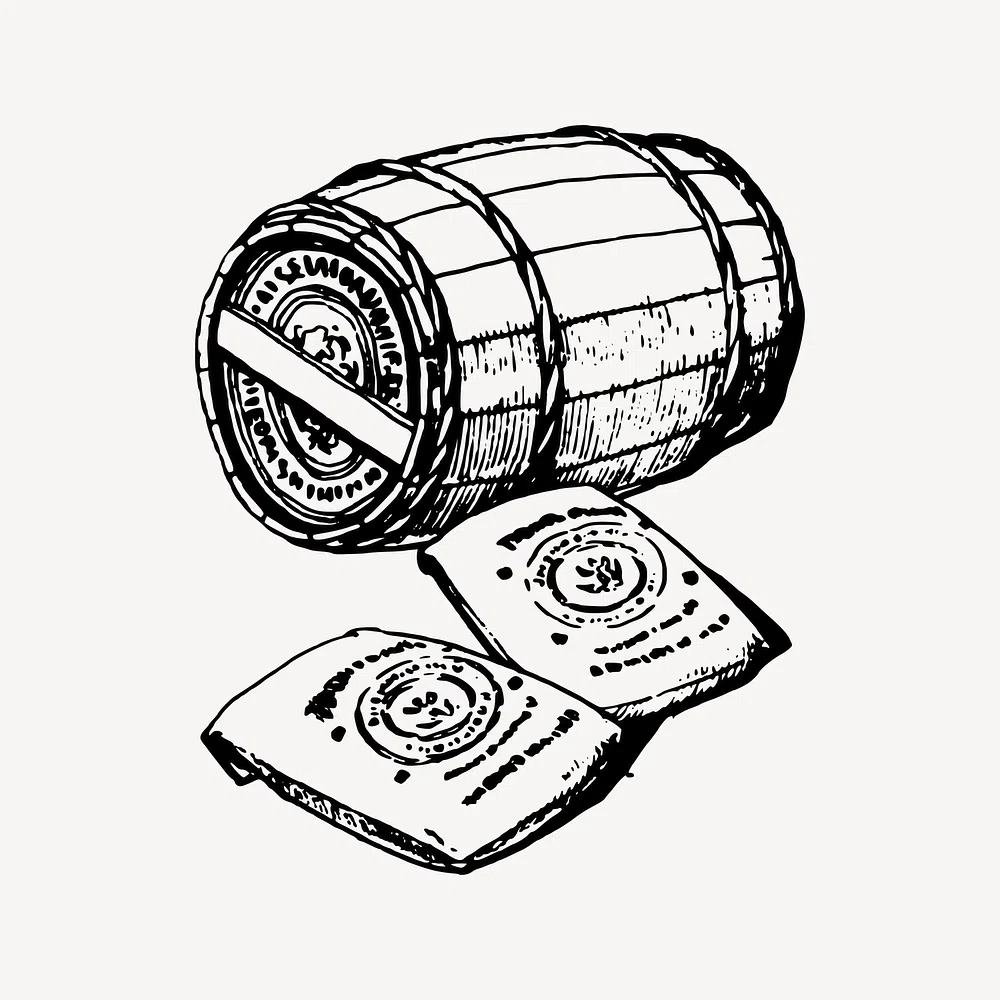
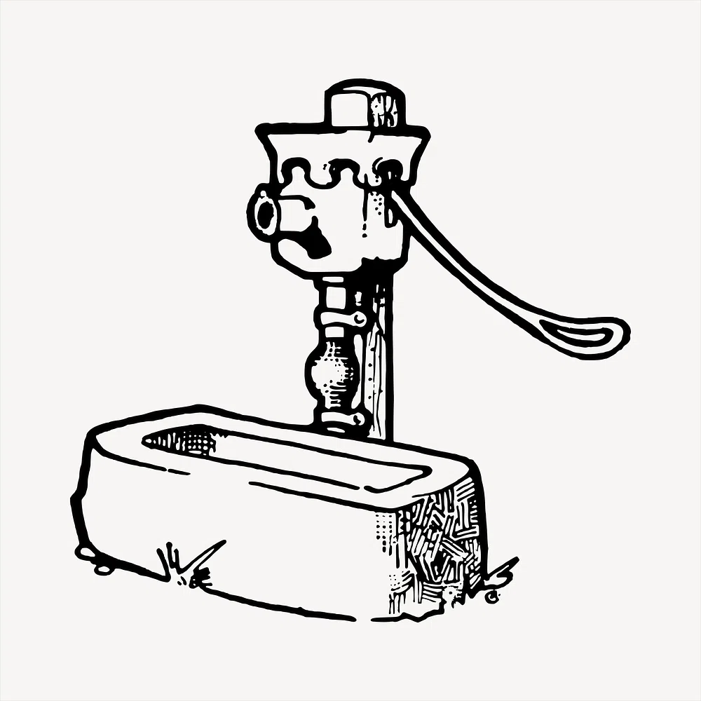

<!-- 
footer: " "
 -->

<!--
paginate: true
 -->

<!-- 
_footer: ''
_paginate: false
 -->

<!-- _class: lead -->

# Collections and Iteration

<br>

### It's Iterators all the way down!


---



- How are Algorithms and Data structures organized in [`std`](rust:std)?

- What are the differences between the Rust collections and the containers in the C++ STL?

- Overview of the idiomatic APIs in [`std`](rust:std)

---

<!-- _class: lead -->

## Iterators and `#include<algorithm>`

### How to operate generically on Collections?

---

<!-- header: ' ' -->

## Foundation: Rust [`Iterator`](rust:std::iter::Iterator)

```rust
pub trait Iterator {
    type Item;

    fn next(&mut self) -> Option<Self::Item>;
}
```

<div data-marpit-fragment>

Very many concepts in this one snippet!

* Associated type [`Item`](rust:std::iter::Iterator::Item): allows the trait implementor to specify the element type
* Method [`next`](rust:std::iter::Iterator::next): returns `Some(Item)` until the iterator is empty, then `None`.

</div>

---

## Create an Iterator from a Collection

Iterators can be created from collections:

````rust tag:playground-button playground-wrap:main
let values = std::collections::HashSet::/*BTreeSet::*/from(['a', 'b', 'c']);

let mut iter = values.into_iter();
let first: Option<char> = dbg!(iter.next());
````

<div data-marpit-fragment>

On exhaustion:

````rust tag:playground-button playground-before:$"fn main() { let values = std::collections::HashSet::/*BTreeSet::*/from(['a', 'b', 'c']); let mut iter = values.into_iter(); let first: Option<char> = dbg!(iter.next());"$ playground-after:$"}"$
let second: Option<char> = dbg!(iter.next());
let third: Option<char> = dbg!(iter.next());
let none: Option<char> = dbg!(iter.next());
````

</div>

---

## Iterators are inherently lazy

An iterator must be actively used to yield elements.

````rust tag:playground-button playground-wrap:main
let values = vec![1, 2, 3];
let iter = values.iter();
iter.map(|val| val + 1);
````

<div data-marpit-fragment>

````
warning: unused `Map` that must be used
4 |     iter.map(|val| val + 1);
  |     ^^^^^^^^^^^^^^^^^^^^^^^
  = note: iterators are lazy and do nothing unless consumed
  = note: `#[warn(unused_must_use)]` on by default
help: use `let _ = ...` to ignore the resulting value
  |
4 |     let _ = iter.map(|val| val + 1);
````

</div>

---

## HowTo disable warnings like this

The warning hints at the name of the check: `#[warn(unused_must_use)]`

````rust tag:playground-button
#[allow(unused_must_use)]
fn main() {
    let values = vec![1, 2, 3];
    let iter = values.iter();
    iter.map(|val| val + 1);
}
````

---

## Implementing the Iterator Trait

Let's implement the famous "fizzbuzz" via iterator.

Most iterators have internal state:

````rust marker:fizzbuzz_struct

````

---

## FizzBuzz Iterator Item Type

Our associated type [`Item`](rust:std::iter::Iterator::Item) is a [`String`](rust:String) to print.

````rust marker:fizzbuzz_iterator_trait_impl_1

````

---

## FizzBuzz Iterator Item Type

It could have been:

````rust
#[derive(Debug, Clone, Copy, PartialEq, Eq, Hash)]
pub enum FizzBuzz {
    Fizz,
    Buzz,
    FizzBuzz,
    Number(u64),
}
````

---

## FizzBuzz Iterator via [`match`](keyword:match)

It's a match!

````rust marker:fizzbuzz_iterator_trait_impl_2

````

---

## FizzBuzz Iterator usage

Here's how to use it (we'll see more on this):

````rust marker:first_20_elems

````

---

## FizzBuzz Iterator usage

Here's how to use it (we'll see more on this):

````rust
let fizzbuzz = Fizzbuzz::default();
for elem in fizzbuzz.take(20) {
    println!("{elem}");
}
````

---

## Constructing Iterators from Collections

Most collections offer three iterator functions:

* `into_iter()`: iterate "by value", consuming the data structure in the process
* `iter()`: iterate over shared references (`&T`) to the items
* `iter_mut()`: iterate over unique, mutable references (`&mut T`) to the items

---

## The Rust Trinity

Here is a fundamental trinity:

- `T`, `&T`, and `&mut T`
- `.into_iter()`, `.iter()`, and `.iter_mut()`.
- [`FnOnce`](rust:std::ops::FnOnce), [`Fn`](rust:std::ops::Fn), [`FnMut`](rust:std::ops::FnMut)

Ownership, Sharing, Mutation

---

## Iterators and For-loops

The type of the expression in a for-loop determines the type of iteration (owned, shared, mutable):

````rust tag:playground-button playground-before:$"#![feature(type_name_of_val)] fn main() {"$ playground-after:$"}"$ playground-channel:nightly
let mut some_vec = vec![1, 2, 4, 8];
for value in &mut some_vec {
    println!("{}", std::any::type_name_of_val(&value));
    break;
}
````

Try changing the expression being iterated upon!

<!-- _footer: 'This uses [`type_name_of_val`](https://doc.rust-lang.org/std/any/fn.type_name_of_val.html)' -->

---

## Custom Iterator Constructors

Some collections offer interfaces to iterate over aspects of their contents:

````rust tag:playground-button playground-before:$"use std::collections::HashMap;"$
fn sum_values<K>(map: &HashMap<K, u32>) -> u32 {
    let mut sum = 0;
    for value in map.values() {
        sum += value;
    }
    sum
}
````

---

## Iterator combinator: [`Iterator::sum`](rust:std::iter::Iterator::sum)

The trait [`Iterator`](rust:std::iter::Iterator) only requires implementing [`Iterator::next`](rust:std::iter::Iterator::next).
The trait defines common generic combinators:

````rust tag:playground-button playground-before:$"use std::collections::HashMap;"$
fn sum_values<K>(map: &HashMap<K, u32>) -> u32 {
    map.values().sum()
}
````

---

## Iterator combinator: [`Iterator::all`](rust:std::iter::Iterator::all)

The [`Iterator::all`](rust:std::iter::Iterator::all) combinator evaluates a predicate for all items:

````rust tag:playground-button playground-before:$"fn main() { let name = "Teddie";"$ playground-after:$"}"$
assert!(name.chars().all(|c| c.is_ascii_alphanumeric()));
````

<!-- _footer: "[Protohackers Budget Chat](https://github.com/barafael/protohackers/blob/f1fe6cf0d6864661efd7d0014edc327ed523114d/budget_chat/src/main.rs#L56)" -->

---

## Iterator combinator: [`Iterator::any`](rust:std::iter::Iterator::any)

The dual of [`Iterator::all`](rust:std::iter::Iterator::all) is [`Iterator::any`](rust:std::iter::Iterator::any).

In this example, tickets may only be dispatched if on that particular day none have been dispatched yet:
```rust
if Self::days(ticket.timestamp1, ticket.timestamp2)
    .any(|day| already_ticketed_days.contains(&day))
{
    tracing::info!("Ignoring ticket starting on {day}: {ticket:?}");
    let day = Self::day(ticket.timestamp1);
}
```

<!-- _footer: "[Protohackers Speedd](https://github.com/barafael/protohackers/blob/f1fe6cf0d6864661efd7d0014edc327ed523114d/speedd/src/collector.rs#L75)" -->

---

## Iterator combinator: [`Iterator::filter`](rust:std::iter::Iterator::filter)

Takes a predicate and yields only the elements for which the predicate is valid.

```rust
let mut iter: Filter<Iter<'_, i32>, _> = a.iter().filter(|x| x.is_positive());
```

<div data-marpit-fragment>

simpler:
```rust
let mut iter: Filter<_, _> = a.iter().filter(|x| x.is_positive());
```

```rust
let mut iter = a.iter().filter(|x| x.is_positive());
```

</div>

<!-- _footer: "[Playground Link](https://play.rust-lang.org/?version=stable&mode=debug&edition=2021&code=use+core%3A%3Aiter%3A%3AFilter%3B%0Ause+std%3A%3Aslice%3A%3AIter%3B%0A%0Afn+main%28%29+%7B%0A++++let+a+%3D+%5B0i32%2C+-1%2C+2%2C+-3%2C+4%5D%3B%0A++++let+mut+iter%3A+Filter%3CIter%3C%27_%2C+i32%3E%2C+_%3E+%3D+a.iter%28%29.filter%28%7Cx%7C+x.is_positive%28%29%29%3B%0A++++%0A++++while+let+Some%28n%29+%3D+iter.next%28%29+%7B%0A++++++++dbg%21%28n%29%3B%0A++++%7D%0A%7D%0A)" -->

---

## Iterator combinator: [`Iterator::map`](rust:std::iter::Iterator::map)

[`Iterator::map`](rust:std::iter::Iterator::map) implements a bijective mapping of the elements in one iterator to the elements in a new one.
The function passed determines the type of the new iterator.

````rust tag:playground-button playground-before:$" pub fn parse_hex_digit(s: &str) -> anyhow::Result<u8> { u8::from_str_radix(s, 16).context("Failed to parse hex byte") } fn main() { let input = "1 a b 4 5 66 7 a";"$ playground-after:$"}"$
input
    .split_whitespace()
    .map(parse_hex_digit)
    .for_each(|item| {
        println!("{item}");
    });
````

<!-- _footer: "[Protohackers Netcrab](https://github.com/barafael/protohackers/blob/f1fe6cf0d6864661efd7d0014edc327ed523114d/netcrab/src/main.rs#L32-L36)" -->

---

## Creating [`collect`](rust:std::iter::Iterator::collect)ions from iterators

`collect` creates a collection from an iterator.
This frequently requires a turbofish or an annotation.

```rust tag:playground-button playground-wrap:main
let values = vec!["birdie", "cat", "doggo"];
let result: HashSet<_> = values
    .iter()
    .map(|a| a.to_uppercase())
    .collect();
```

The type annotation fixes a degree of freedom of [`collect`](rust:std::iter::Iterator::collect).

---

## Creating [`collect`](rust:std::iter::Iterator::collect)ions from iterators

Sometimes, a turbofish is required:

```rust
let line = input                    // String
    .split_whitespace()             // SplitWhitespace
    .map(parse_hex_digit)           // impl Iterator<Item = Result<u8, Error>>
    .collect::<Result<Vec<u8>>>()?; // Vec<u8>
```

Here, the turbofish fixes a degree of freedom of [`collect`](rust:std::iter::Iterator::collect).

The target collection is a `Result<Vec<u8>, Error>` - because a `Result<T, E>` can be seen as some kind of collection, too.

<!-- _footer: "[Protohackers Netcrab](https://github.com/barafael/protohackers/blob/f1fe6cf0d6864661efd7d0014edc327ed523114d/netcrab/src/main.rs#L32)" -->

---

## Collecting HashMaps

````rust tag:playground-button playground-wrap:main
let map: std::collections::HashMap<char, bool> =
    [('a', true), ('b', false), ('c', false), ('z', true)]
        .into_iter()
        .collect();
dbg!(map);
````

---

## `Vec<Result<T, E>>` or `Result<Vec<T>, E>`?

`parse_hex_digit` returns a `Result<T, E>`, so the iterator item type becomes `Iterator<Item = Result<u8, Error>>`

What we want is a `Result<Vec<T>, E>`.

````rust tag:playground-button playground-before:$" pub fn parse_hex_digit(s: &str) -> anyhow::Result<u8> { u8::from_str_radix(s, 16).context("Failed to parse hex byte") } fn main() { let input = "1 a b 4 5 66 7 a";"$ playground-after:$"}"$
input
    .split_whitespace()
    .map(parse_hex_digit)
    .for_each(|item| {
        println!("{item}");
    });
````

---

## `Iterator<Item = Result<T, E>> -> Result<Vec<T>, E`

This is a ubiquitous pattern:

```rust
let handles = env
    .interfaces
    .iter()
    .map(|(interface, socket_addr)| {
        socket::open(interface, socket_addr).map(|socket| (socket, interface))
    })
    .collect::<Result<Vec<_>, _>>()?;
```

---

## Collecting and [`Result<Collection, E>`](https://doc.rust-lang.org/std/result/)

The [`FromIterator<A>`](rust:std::iter::FromIterator) Trait is required to implement [`collect`](rust:std::iter::Iterator::collect).

```rust
impl<A, E, V: FromIterator<A>> FromIterator<Result<A, E>> for Result<V, E>
```

Rule of thumb: use [`collect`](rust:std::iter::Iterator::collect) to collect into collection-like things.

<div data-marpit-fragment>

</div>

---

## Collecting and [`try_join_all`](https://docs.rs/futures/latest/futures/future/fn.try_join_all.html)

A realistic example with future combinators:

```rust
// let handles: Vec<JoinHandle> = ...;
futures::future::try_join_all(handles)
    .await
    .context("Unable to join client tasks")?
    .into_iter() // IntoIter<Result<(), Error>>
    .collect::<Result<(), _>>() // Result<(), Error>
    .context("Error in client task")
```

This pattern is used all over the place.

<!-- _footer: "
[Achat: chat with cancellation](https://github.com/barafael/achat/blob/c8fa30d90b703b41993e04f53fe474070b0ab199/bin/chat_with_cancel.rs#L51)
" -->

---

## More combinator

`map`, `filter`, `collect` are just the beginning.

[Provided Methods of `Iterator`](https://doc.rust-lang.org/std/iter/trait.Iterator.html#provided-methods)

[Provided Methods of String Slices (`&str`)](https://doc.rust-lang.org/std/primitive.str.html)

[`chain`](rust:std::iter::Iterator::chain), [`zip`](rust:std::iter::Iterator::zip), [`cycle`](rust:std::iter::Iterator::cycle), [`take`](rust:std::iter::Iterator::take), [`fold`](rust:std::iter::Iterator::fold), ...

Even more in [itertools](https://github.com/rust-itertools/itertools): `windows`, `interleave`, `collect_vec`, `join`, `partition`, `peek_nth`

---

## Aside: Parallel Iterators

Iteration is already threadsafe. Why not capitalize on that?

```rust
let mut pixels = img.enumerate_pixels_mut().collect::<Vec<_>>();

pixels.par_iter_mut().for_each(|(x, y, pixel)| {
    let steps = convergence_steps(
        ...
    );
    **pixel = colorgrad(steps, &colorgrad::turbo());
});
```

<!-- _footer: "[Julia Set Renderer mit Rayon](https://github.com/cocomundo/julia-set-renderer/blob/b88241ba482c0af1269a990ad3184d47179e7144/src/lib.rs#L42)" -->

---

## Julia Fractal


---

## Iterators beyond Collections

Many other functions return an iterator less related to collections:

* `std::env::args()`: program binary args
* `std::str::matches()`: matches of a pattern in a string
* Our fibonacci implementation

---

## The HashMap Entry API

The entry API is the idiomatic and ergonomic way to edit map entries.
Entries are mutated in-place:
```rust
pub enum Entry<'a, K: 'a, V: 'a> {
    Occupied(OccupiedEntry<'a, K, V>),
    Vacant(VacantEntry<'a, K, V>),
}
```

Rationale & usage at "[A Rust Gem - The Rust Map API](https://www.thecodedmessage.com/posts/rust-map-entry/)"

---

## Example: [`or_insert`](rust:std::collections::hash_map::Entry::or_insert)

If an entry doesn't exist, insert the default, then return a mutable reference to the entry:

````rust tag:playground-button playground-wrap:main
use std::collections::HashMap;
let mut counts: HashMap<&str, usize> = HashMap::new();
for letter in ["a", "b", "c", "a", "a"] {
    *counts.entry(letter).or_insert(0) += 1;
}
dbg!(counts);
````

---

## Example: [`or_default`](rust:std::collections::hash_map::Entry::or_default)

The previous example, just simpler:

````rust tag:playground-button playground-wrap:main
use std::collections::HashMap;
let mut counts: HashMap<&str, usize> = HashMap::new();
for name in ["a", "b", "c", "a", "a"] {
    *counts.entry(name).or_default() += 1;
}
````

Which default value here? Obviously the trait [`Default`](rust:std::default::Default)!

---

## Example: [`and_modify`](rust:std::collections::hash_map::Entry::and_modify)

Not sure why exactly this exists, to be honest:

```rust
edges.entry(dv.init).and_modify(|e| *e += 1).or_insert(1);
```

Equivalent:

```rust
*edges.entry(dv.init).or_default() += 1;
```

<!-- _footer: "[facebook/hhvm](https://github.com/facebook/hhvm/blob/c01bc30d5883ffdf08329111fa709ed9da815ad5/hphp/hack/src/hackc/ir/conversions/ir_to_bc/emitter.rs#L171)" -->

---

## Review

 - Collections
 - Iterators
 - Iterator Combinators
 - The HashMap Entry API



---

## Questions?

<iframe style="margin-top:5%" width="100%" height="80%" src="https://play.rust-lang.org/?version=stable&mode=debug&edition=2021&code=fn+main%28%29+%7B%7D%0A">
</iframe>
