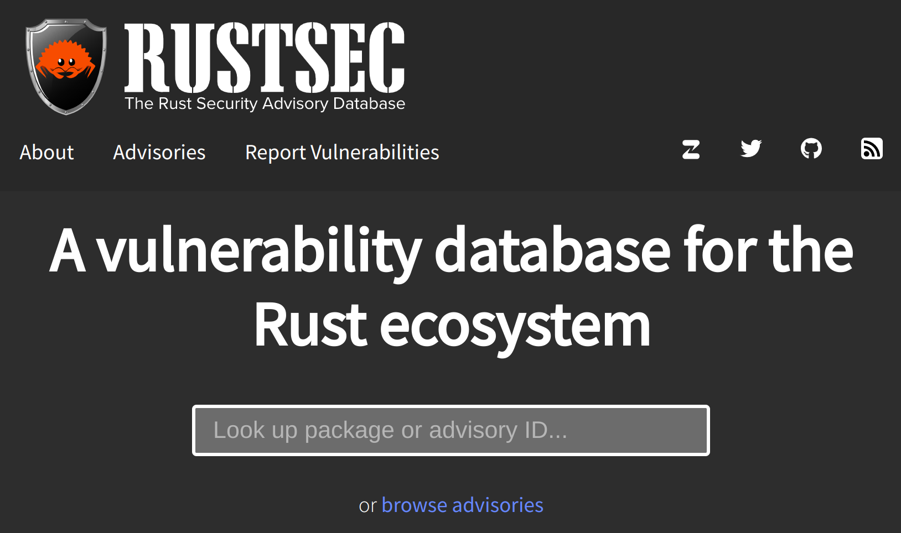
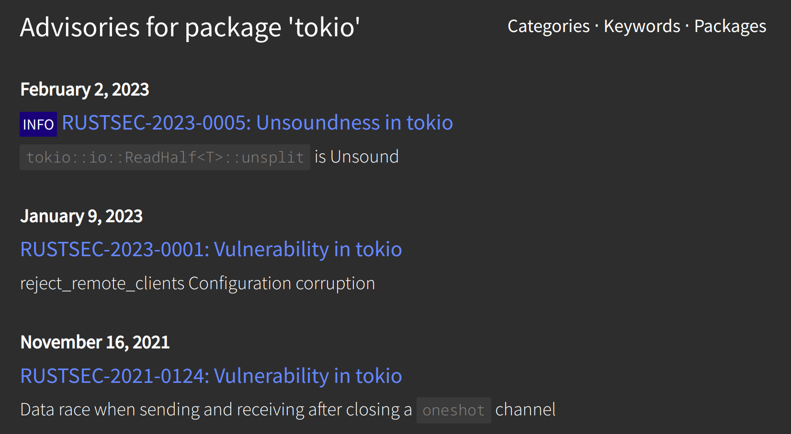
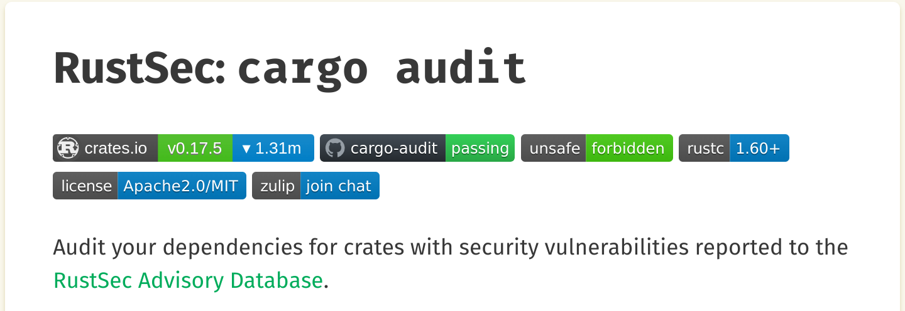

<!--
paginate: true
 -->

<!-- 
_footer: ''
_paginate: false
 -->

<!-- _class: lead -->

# Cargo, Crates and Registries

---

### How to manage proprietary crates?

### How to include modified/patched crates?

### How to supply guaranteed reproducible build environments?

### How to reduce dependency on the internet and [crates.io](crates.io)

---

<!-- header: ' ' -->

## A Vanilla Rust Projekt with `Cargo.toml`

Nothing special:

```toml
[package]
name = "flipper"
version = "0.1.0"
edition = "2021"

[dependencies]
anyhow = "1.0.62"
futures = "0.3.23"
tokio = { version = "1.20.1", features = ["full"] }
tokio-stream = "0.1.9"
```

---

## Promises of [crates.io](crates.io)

* Once published, a crate version stays available
* This also applies to crate versions which have been "yanked" (unlisted)
* Valid dependency declarations
* Valid build

---

## Aside: RustSec and [`cargo audit`](https://crates.io/crates/cargo-audit)

Crates.io doesn't make any assertions about CVEs, but:



---

## Aside: RustSec and [`cargo audit`](https://crates.io/crates/cargo-audit)

Crates.io doesn't make any assertions about CVEs, but:



---

## Aside: RustSec and [`cargo audit`](https://crates.io/crates/cargo-audit)

Lists known CVEs in all your dependencies and recommends mitigations.



---

## Local dependencies

Via a path dependencies from the local disc can be included (while developing):

```toml
[dependencies]
flippus = { path = "../flippus" }
```

Crates.io will reject a crate with a path dependencies, though. Alternative:

```toml
[dependencies]
flippus = { path = "../flippus", version = "0.4.0" }
```

---

## Dependencies on GitHub (etc.)

Remote git repos can be included via git URL:

```toml
[dependencies]
flippus = { git = "https://github.com/the_username/flippus" }
```

This also supports more detail:

```toml
[dependencies]
flippus = { git = "https://github.com/the_username/flippus", branch = "release" }
```

---

## Aside: Overwriting Crates

In the `[patch]` section in `Cargo.toml` dependencies may be specifically replaced across the crate tree.
Use cases: Testing a fix before publish, using a pre-released crate (see embassy), modifying a crate without publishing yet

```toml
[patch.crates-io]
embassy-time = { git = "https://github.com/embassy-rs/embassy" }
embassy-futures = { git = "https://github.com/embassy-rs/embassy" }
```

<!-- _footer: "The Cargo Book: [Overriding Dependencies](https://doc.rust-lang.org/cargo/reference/overriding-dependencies.html#overriding-dependencies)" -->

---

## Crate Downloading Tools

* [Cargo Download](https://crates.io/crates/cargo-download): Downloads a GZIP of a crate at a given version
* [Cargo Clone](https://crates.io/crates/cargo-clone): Downloads the sources of a crate at a given version
* [Cargo Vendor](https://crates.io/crates/cargo-vendor): Downloads all dependencies of a crate locally and makes them usable for build

<!-- _footer: 'These tools are somewhat rarely used in Community, and no longer much used in corporate settings.' -->

---

## [`cargo vendor`](https://crates.io/crates/cargo-vendor): Source Replacement

```toml
 flipper $> cargo vendor
...
   Vendoring xml-rs v0.8.4 (/home/rafael/.cargo/registry/src/github.com-<hash>/xml-rs-0.8.4) to vendor/xml-rs
...
To use vendored sources, add this to your .cargo/config.toml for this project:

[source.crates-io]
replace-with = "vendored-sources"

[source."git+https://github.com/user/flippus"]
git = "https://github.com/user/flippus"
replace-with = "vendored-sources"

[source.vendored-sources]
directory = "vendor"
```

git dependencies are supported.

---

## [`cargo vendor`](https://crates.io/crates/cargo-vendor): File structure

<style scoped>
table, tr, td, th {
  all: unset;
  border: 0 !important;
  background: transparent !important;
}
table { display: table; }
tr { display: table-row; }
td, th { display: table-cell; }

table {
  width: 100%;
}
td {
  vertical-align: middle;
  width: 10%;
  padding: 0 15px;
}
</style>
<table>
<td>

```
 flipper $> tree .
.
├── ...
└── vendor
    ├── async-stream
    │   ├── Cargo.toml
    │   ├── src
    │   │   ├── lib.rs
    │   └── tests
    │       ├── for_await.rs
...

2023 directories, 14140 files

```
</td>
<td>
All dependencies are local.
But, better do not edit!

To edit a dependency:
fork, then include via git, or patch
</td>
</tr>
</table>

---

## [`cargo vendor`](https://crates.io/crates/cargo-vendor): Caveats

For each meaningful change in `Cargo.toml`, vendoring must be triggered. This could be done in `build.rs`.

Vendoring is not a great idea in general. It is low-visibility because in the open source world there is not much incentive to use it.

Regardless, the Cargo Book offers a [Chapter about Cargo Vendor](https://doc.rust-lang.org/cargo/commands/cargo-vendor.html).

---

## [`cargo local-registry`](https://crates.io/crates/cargo-local-registry)

Local registries can cache all used crates from `crates.io` locally.

A local registry is a directory with an index and a bunch of tarballs.

A local registry must be manually updated whenever the crate graph changes.
It never includes proprietary crates, it can only mirror `crates.io`.

---

## [`cargo local-registry`](https://crates.io/crates/cargo-local-registry): Setup

Initialize and build a registry:

```shell
 flipper $> cargo local-registry --sync Cargo.lock my-registry
add this to your .cargo/config somewhere:

    [source.crates-io]
    registry = 'https://github.com/rust-lang/crates.io-index'
    replace-with = 'local-registry'

    [source.local-registry]
    local-registry = '/home/user/flipper/my-registry'
```

---

## [`cargo local-registry`](https://crates.io/crates/cargo-local-registry): Structure

```shell
 flipper $> tree .
.
├── clap-3.2.23.crate
├── clap_derive-3.2.18.crate
├── clap_lex-0.2.4.crate
├── index
│   ├── cl
│   │   ├── ap
│   │   │   ├── clap
│   │   │   ├── clap_derive
│   │   │   └── clap_lex
│   │   └── ip
│   │       └── clipboard-win
```

---

## `cargo local-registry` and workspaces

It makes sense to share a local registry with several projects to avoid saving dependencies several times over.
This can be achieved by putting all crates in a Cargo Workspace and adding the registry there.

But: Workspaces have downsides (namely buiding crates for differing target architectures)

<!-- _footer: "[Example workspace](https://github.com/barafael/protohackers)" -->

---

## Managing custom private registries

There are some services which offer custom registries. But as of now it is not easy to set up.

Advantages:

* Management of custom proprietary crates possible
* Rustdoc servable
* User permission management, tokens, etc.

---

## Managing custom private registries

Cargo compatibility:

In `flipper/.cargo/config.toml`:
```toml
[registries.dolphin]
index = "https://git.shipyard.rs/dolphin/crate-index.git"
```
and, in `Cargo.toml`:
```toml
publish = ["dolphin"]
```

---

## Providers of private registries

* [meuse.mcorbin.fr](meuse.mcorbin.fr)
    - Open Source and Storage-agnostic
    - Fanatics note that it is written in Clojure ([Grund](https://www.reddit.com/r/rust/comments/cs14dh/comment/exe5zxj/))

* [shipyard.rs](shipyard.rs)
    - Active and passionate dev community
    - [Blogpost](https://fasterthanli.me/series/building-a-rust-service-with-nix/part-7) by [Fasterthanlime](fasterthanli.me)
    - Free Tier (for evaluation)
    - uses Meuse, Gitea, actix-web

---

## Providers of private registries

* [ktra](https://book.ktra.dev/)
    - Open Source
    - As minimal as possible, but solid project

* [cloudsmith.io](https://help.cloudsmith.io/docs/cargo-registry)
    - were the [first](https://www.reddit.com/r/devops/comments/bjitie/worlds_first_private_cargo_registry_rust/)

* [JFrog Artifactory](https://jfrog.com/knowledge-base/how-to-run-a-private-cargo-registry/)
    - Free Tier
    - Cloud/on-prem storage

---

## Providers of private registries

JFrog in particular is zero-hassle setup and use. IT should manage it.

In case of hassle: remove `Cargo.lock`, then `cargo clean`, then `cargo b`.