<style>
img[alt~="center"] {
  display: block;
  margin: 0 auto;
}
</style>

<!--
paginate: true
 -->
<!-- 
_footer: ''
_paginate: false
 -->
<!-- _class: lead -->

# Hello Rust<br>Getting Started


---

## Overview


Install Rust and the toolchain

Get to know Cargo and the ecosystem

Help choosing an IDE ecosystem

---

<!-- header: ' ' -->

## [rustup.rs](rustup.rs) - The Rust Toolschain Installer

"The benefit of using the Rustup toolchain manager instead of the standalone prepackaged Rust in the software repository is the ability to install multiple toolchains (...) for multiple targets (...) and architectures (...)."

<p style = "text-align: right">- Arch Wiki</p>

Rustup is the recommended installation method (not the distro package manager)

---

## [rustup.rs](rustup.rs) - The Rust Toolchain Installer

<p style = "text-align: center"><a href="https://www.rustup.rs">rustup.rs</a></p>

```bash
$> curl --proto '=https' --tlsv1.2 -sSf https://sh.rustup.rs | sh
```

Yes, it's `curl | sh`. It's kind of like downloading an installer?

For windows: [https://win.rustup.rs/x86_64](https://win.rustup.rs/x86_64)

---

## Rustup Commands

```bash
$ rustup update
$ rustup self update
$ rustup default nightly
$ rustup target add thumbv7em-none-eabihf
$ rustup target add wasm32-unknown-unknown
$ rustup component add clippy
$ rustup component add rustfmt
$ rustup component add rust-src
$ rustup show
$ rustup doc
```

---

## Installation Test: Rustlings

Rustlings is a collection of Rust Exercises, which include well-placed errors.
Goal: learn by repairing them.

<p style = "text-align: center"><a href="https://www.github.com/rust-lang/rustlings">github.com/rust-lang/rustlings</a></p>

```bash
curl -L https://raw.githubusercontent.com/rust-lang/rustlings/main/install.sh | bash
```

<p style = "text-align: center"><code>$> rustlings</code><br><code>$> rustlings watch</code></p>

---

## Docs via Rustup

Get the official book:

```
rustup docs --book
```

More general resources:

```
rustup docs
```

<!-- _footer: 'In case it doesn't work: `rustup component add rust-docs`' -->

---

## IDE via LSP: VSCode

LSP: Language Server Protocol von Microsoft
Entkoppelt Editor von der IDE

Rust Analyzer ist wohl die wichtigste Erweiterung,
der Rest ist Beiwerk, aber auch sinnvoll.

IDE-Support in Rust war kein ursprünglicher Fokus,
jahrelang wurde der Compiler refaktoriert, um IDE Support und inkrementelle Kompilation zu erhalten.

Zwischendurch gab es Racer, RLS, …

---

## Plugins für VSCode

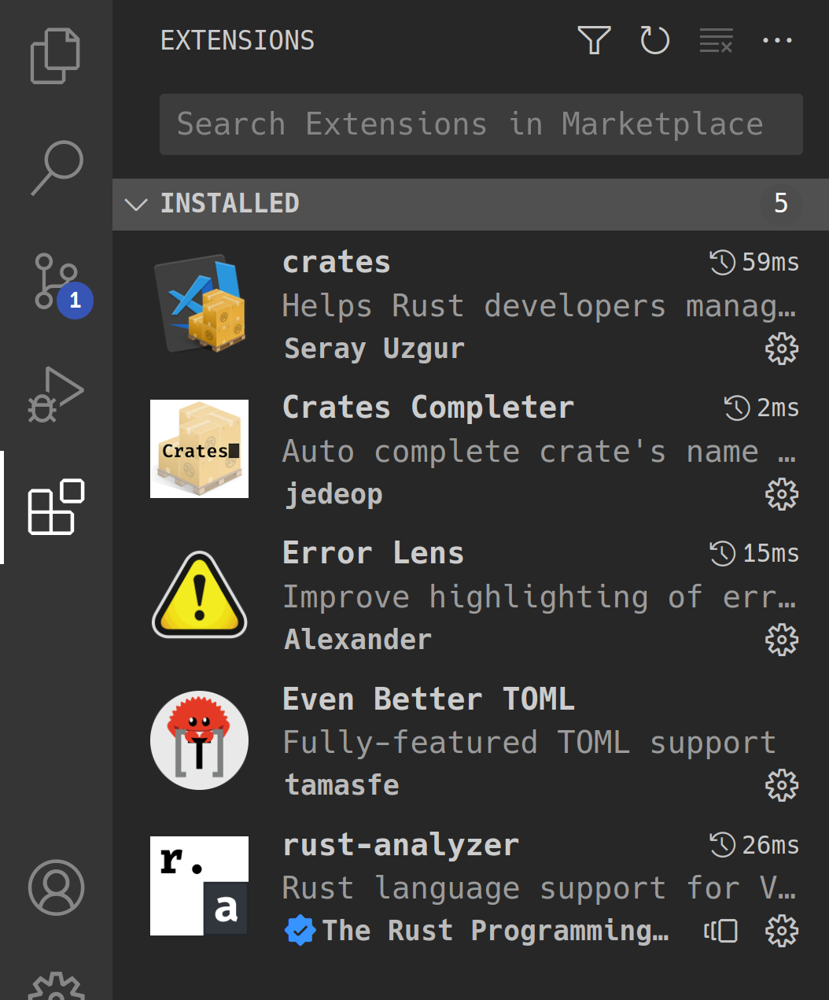

Empfohlen (mit Reihenfolge):

1. Rust Analyzer
2. Even Better TOML
3. crates
4. Error Lens
5. Crates Completer

---

## Even Better TOML

Es gab mal `TOML`, dann `Better TOML`, jetzt `Even Better TOML`...

Empfehlung generell: `FormatOnSave: true`

Aber: Achtung, kann manchmal große ungewollte Diffs erzeugen

---

## VSCode LSP Integration

Quickfixes:

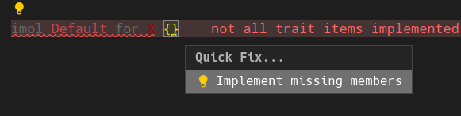

wird zu:

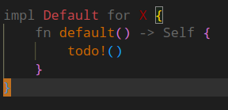

---

## VSCode LSP Integration

Crate Version Management:


---

## Error Lens

Inline Errors:

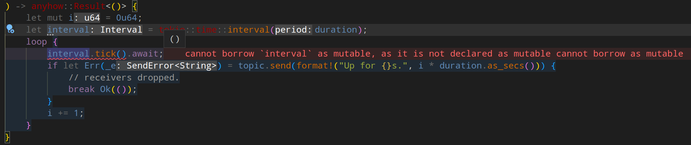

---

## Inline Run + Debug Buttons

Funktionieren auch für unit tests!


---

## Hover Docs

Manchmal etwas nervig, aber super praktisch:

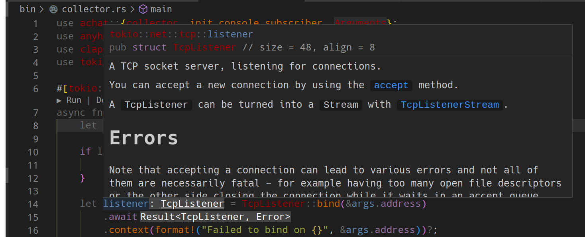

---

## JetBrains Rust Support

Gerne verwendet auch im kommerziellen Umfeld

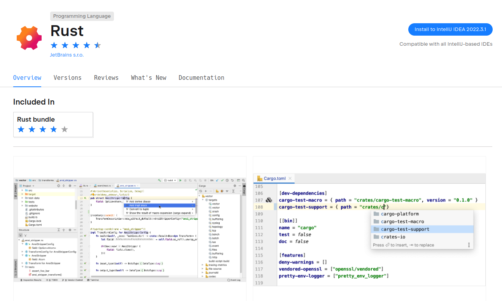

---

## JetBrains Hover Tips

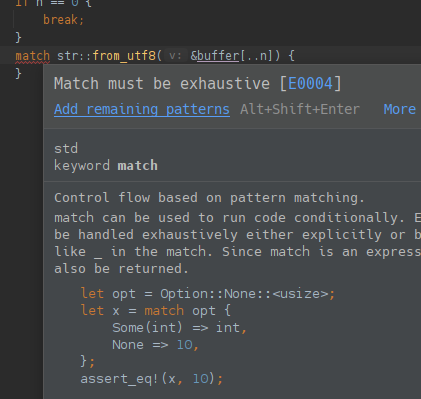

---

## JetBrains Inline Docs

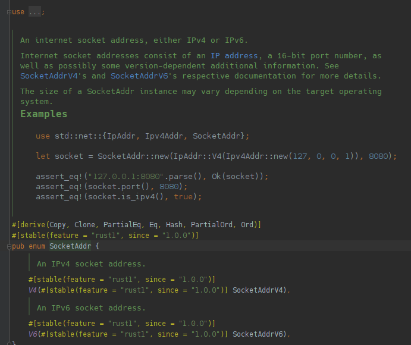

---

## JetBrains Profiler

Sehr komfortabel direkt eingebaut, auch Coverage

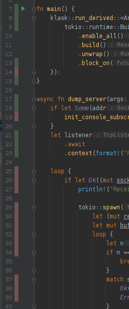

---

## JetBrains `Cargo.toml` und Inspektion

<style scoped>
table, tr, td, th {
  all: unset;
  border: 0 !important;
  background: transparent !important;
}
table { display: table; }
tr { display: table-row; }
td, th { display: table-cell; }

table {
  width: 100%;
}
td {
  vertical-align: middle;
  width: 10%;
  padding: 0 15px;
}
</style>
<table>
<td>

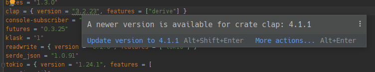

</td>
<td>

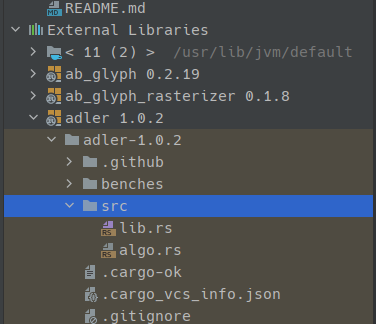

</td>
</tr>
</table>

---

## JetBrains Code Inspector

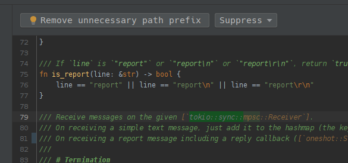