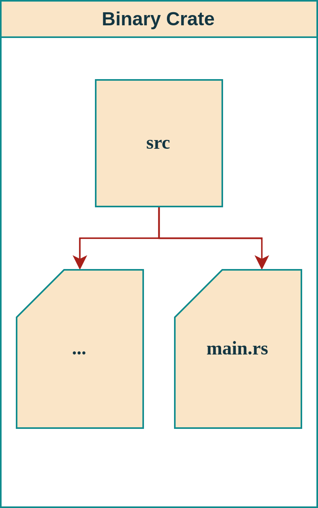
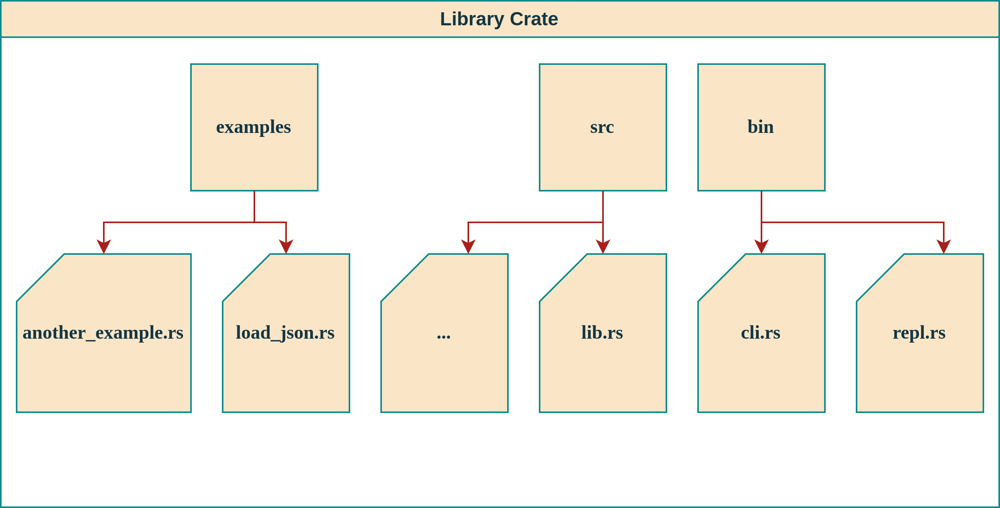
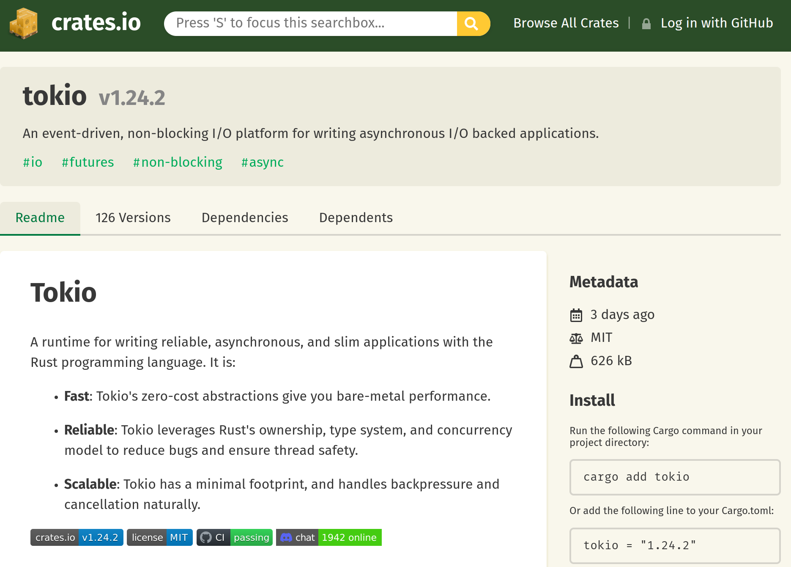
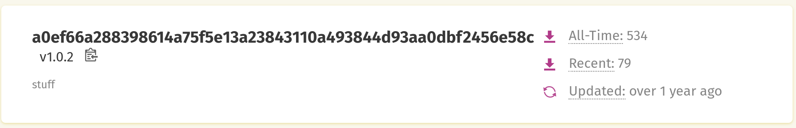
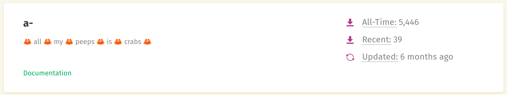
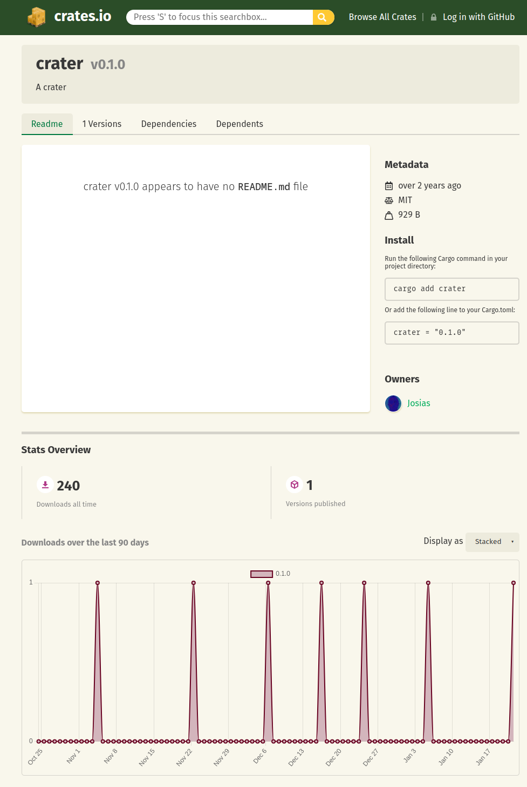
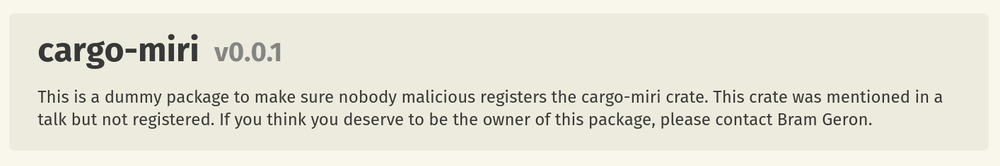
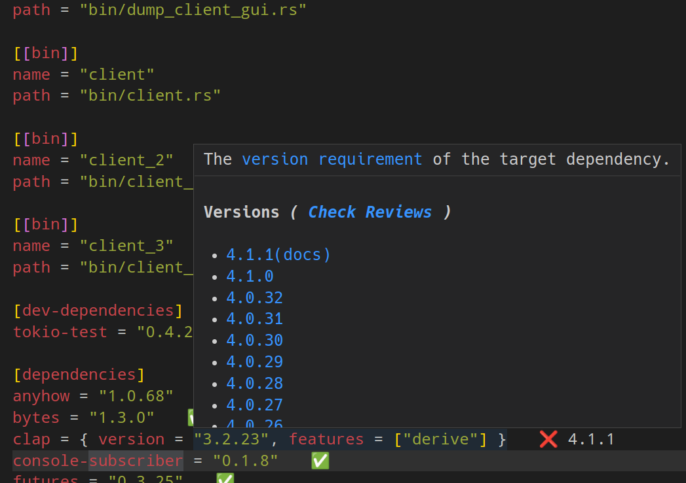

<style>
img[alt~="center"] {
  display: block;
  margin: 0 auto;
}
</style>

<!--
paginate: true
 -->
<!-- 
_footer: ''
_paginate: false
 -->
<!-- _class: lead -->

# Hello Rust<br>Getting Started


---

## Overview


Install Rust and the toolchain

Get to know Cargo and the ecosystem

---

<!-- header: ' ' -->

## [rustup.rs](rustup.rs) - The Rust Toolschain Installer

"The benefit of using the Rustup toolchain manager instead of the standalone prepackaged Rust in the software repository is the ability to install multiple toolchains (...) for multiple targets (...) and architectures (...)."

<p style = "text-align: right">- Arch Wiki</p>

Rustup is the recommended installation method (not the distro package manager)

---

## [rustup.rs](rustup.rs) - The Rust Toolchain Installer

<p style = "text-align: center"><a href="https://www.rustup.rs">rustup.rs</a></p>

```bash
$> curl --proto '=https' --tlsv1.2 -sSf https://sh.rustup.rs | sh
```

Yes, it's `curl | sh`. It's kind of like downloading an installer?

For windows: [https://win.rustup.rs/x86_64](https://win.rustup.rs/x86_64)

---

## Rustup Commands

```bash
$ rustup update
$ rustup self update
$ rustup default nightly
$ rustup target add thumbv7em-none-eabihf
$ rustup target add wasm32-unknown-unknown
$ rustup component add clippy
$ rustup component add rustfmt
$ rustup component add rust-src
$ rustup show
$ rustup doc
```

---

## Installation Test: Rustlings

Rustlings is a collection of Rust Exercises, which include well-placed errors.
Goal: learn by repairing them.

<p style = "text-align: center"><a href="https://www.github.com/rust-lang/rustlings">github.com/rust-lang/rustlings</a></p>

```bash
curl -L https://raw.githubusercontent.com/rust-lang/rustlings/main/install.sh | bash
```

<p style = "text-align: center"><code>$> rustlings</code><br><code>$> rustlings watch</code></p>

---

## Docs via Rustup

Get the official book:

```
rustup docs --book
```

More general resources:

```
rustup docs
```

<!-- _footer: 'Falls es nicht funktioniert: `rustup component add rust-docs`' -->

---

## Rustc and Cargo

`rustc` has a CLI, which almost nobody uses. Cargo is the way!

`cargo new --bin crate_name` or `cargo new --lib lib_name`

<style scoped>
table, tr, td, th {
  all: unset;
  border: 0 !important;
  background: transparent !important;
}
table { display: table; }
tr { display: table-row; }
td, th { display: table-cell; }

table {
  width: 100%;
}
td {
  vertical-align: middle;
  width: 10%;
  padding: 0 15px;
}
</style>
<table>
<td>



</td>
<td>



</td>
</tr>
</table>

---

## Cargo.toml

```toml
[package]
name = "achat"
version = "0.1.0"
edition = "2021"
description = "Super simple tokio chat server for educational purposes."
repository = "https://github.com/barafael/achat"

[dependencies]
anyhow = "1.0.68"
tokio = { version = "1.24.1", features = [
    "io-util",
    "macros",
] }
```

---

## Cargo.toml

Dependencies via path or git repo:

```toml
[dependencies]
klask = { path = "../klask", features = ["json"], default-features = true }
transmogrifier = { git = "https://github.com/barafael/pils" }
```

---

## Cargo.toml

```toml
[[bin]]
name = "chat"
path = "bin/chat.rs"

[dev-dependencies]
tokio-test = "0.4.2"

[build-dependencies]
phf = { version = "0.11.1", default-features = false }
phf_codegen = "0.11.1"
```

---

## Cargo.toml

```toml
[features]

default = [
  "std",
  "backend-winit",
  "backend-qt",
  "compat-1-0",
]

std = ["i-slint-core/std"]
libm = ["i-slint-core/libm"]
log = ["dep:log"]
```

<!-- _footer: "[Slint Project Cargo TOML](https://github.com/slint-ui/slint/blob/c11415dbbbbd93350ba1899114fe8517c8a16641/api/rs/slint/Cargo.toml#L20)" -->

---

## Semantic Versioning

The individual fields of MAJOR.MINOR.PATCH have strictly defined meanings:

<style scoped>
p {
  font-size: 25px;
}
</style>

> Given a version number MAJOR.MINOR.PATCH, increment the:
> MAJOR version when you make incompatible API changes
> MINOR version when you add functionality in a backward compatible manner
> PATCH version when you make backward compatible bug fixes

This applies primarily to lib crates.

<!-- _footer: "Aus [semver.org/lang/de/](semver.org/lang/de/)" -->

---

## Semantic Versioning

Additionally, some crates append pre-release and build info:

```toml
embedded-hal = { version = "1.0.0-alpha.10" }
```

---

## Cargo.toml and Cargo.lock

```toml
[dev-dependencies]
tokio-test = "0.4.2"

[dependencies]
anyhow = "1.0.68"
tokio = { version = "1.24.1", features = [
    "io-util",
    "macros",
] }
```

---

## Cargo.toml and Cargo.lock

```toml
[dev-dependencies]
tokio-test = "*"

[dependencies]
anyhow = "1"
tokio = { version = "1", features = [
    "io-util",
    "macros",
] }
```

---

```toml
[[package]]
name = "anyhow"
version = "1.0.68"
source = "registry+https://github.com/rust-lang/crates.io-index"
checksum = "2cb2f989d18dd141ab8ae82f64d1a8cdd37e0840f73a406896cf5e99502fab61"

[[package]]
name = "andrew"
version = "0.3.1"
source = "registry+https://github.com/rust-lang/crates.io-index"
checksum = "8c4afb09dd642feec8408e33f92f3ffc4052946f6b20f32fb99c1f58cd4fa7cf"
dependencies = [
 "bitflags",
 ...
]
```

---

## Why not just be explicit about versions?

* A library can declare a dependency on a range of versions of another library. This leaves freedom for the crate version resolver.
* Duplicate dependencies can be reduced if they stem from a compatible range.
* Compatible types can be used from slightly differing but compatible crate versions.

Cargo.lock is usually not edited manually.
`cargo update` updates the specific chosen versions.

---

## Transitive Dependencies

The same dependency in different subtrees at differing revision is not a problem.

But, a crate can publicly export types in its public interface.
Of course, then there may not be any inconsistencies.

---

## Transitive Abhängigkeiten

Transitive deps go fat quickly:


<!-- _footer: "[cargo depgraph](https://github.com/jplatte/cargo-depgraph) auf [github.com/barafael/achat](https://github.com/barafael/achat)" -->

---

## Cargo.toml and Cargo.lock

From "Cargo.toml vs. Cargo.lock" in the Cargo Book:

“If you’re building a non-end product, such as a rust library that other rust packages will depend on, put Cargo.lock in your .gitignore.
If you’re building an end product, which are executable like command-line tool or an application, [...] check Cargo.lock into git.”

Also: Cargo.lock hauptsächlich relevant für Binary Crates! 

<!-- _footer: '[Chapter in the Cargo Book](https://doc.rust-lang.org/cargo/guide/cargo-toml-vs-cargo-lock.html)' -->
---

## Change in advisory, though

https://github.com/rust-lang/cargo/issues/8728

---

## Crates.io

Central repo for all Rust crates. Authenticated maintainers can:
* Publish new crates
* Publish new versions of their crates
* "Yank" old versions of crates (doesn't remove a version, but prevents it from being added newly)

---

## Crates.io



---

## Crates.io - Namespace Pollution



---

## Crates.io - Namespace Occupation



---

## Crates.io - <br>Name Squatting

Ah the irony!

This crate called "Crater" was occupied (has no content since 2 years).
The only downloads happen through the crater project...



<!-- _footer: "[https://crates.io/crates/crater](https://crates.io/crates/crater)" -->

---

## Crates.io: Reverse Name Squatting

Clever move: to ensure no typosquatting, this crate was hogged:



---

## Vulnerability Index

RustSec sammelt CVEs. Beispiel:

__RUSTSEC-2020-0071__
Potential segfault in the time crate:
https://rustsec.org/advisories/RUSTSEC-2020-0071.html

__RUSTSEC-2022-0081__
json is unmaintained:
https://rustsec.org/advisories/RUSTSEC-2022-0081.html

---

### Cargo Audit (RustSec Advisories in Cargo.lock)

```
> cargo audit
   Fetching advisory database from `https://github.com/RustSec/advisory-db.git`
     Loaded 486 security advisories (from /home/rafaelbachmann/.cargo/advisory-db)
   Updating crates.io index
   Scanning Cargo.lock for vulnerabilities (59 crate dependencies)
Crate:    alloc-cortex-m
Version:  0.4.4
Warning:  unmaintained
Title:    crate has been renamed to `embedded-alloc`
Date:     2022-12-21
ID:       RUSTSEC-2022-0073
URL:      https://rustsec.org/advisories/RUSTSEC-2022-0073
Dependency tree:
alloc-cortex-m 0.4.4
└── wasmi-m4 0.1.0
```

<!-- _footer: "[rustsec.org](rustsec.org)" -->

---

## IDE via LSP: VSCode

LSP: Language Server Protocol von Microsoft
Entkoppelt Editor von der IDE

Rust Analyzer ist wohl die wichtigste Erweiterung,
der Rest ist Beiwerk, aber auch sinnvoll.

IDE-Support in Rust war kein ursprünglicher Fokus,
jahrelang wurde der Compiler refaktoriert, um IDE Support und inkrementelle Kompilation zu erhalten.

Zwischendurch gab es Racer, RLS, …

---

## Plugins für VSCode


Empfohlen (mit Reihenfolge):

1. Rust Analyzer
2. Even Better TOML
3. crates
4. Error Lens
5. Crates Completer

---

## Even Better TOML

Es gab mal `TOML`, dann `Better TOML`, jetzt `Even Better TOML`...

Empfehlung generell: `FormatOnSave: true`

Aber: Achtung, kann manchmal große ungewollte Diffs erzeugen

---

## VSCode LSP Integration

Quickfixes:


wird zu:


---

## VSCode LSP Integration

Crate Version Management:



---

## Error Lens

Inline Errors:


---

## Inline Run + Debug Buttons

Funktionieren auch für unit tests!


---

## Hover Docs

Manchmal etwas nervig, aber super praktisch:


---

## JetBrains Rust Support

Gerne verwendet auch im kommerziellen Umfeld


---

## JetBrains Hover Tips


---

## JetBrains Inline Docs


---

## JetBrains Profiler

Sehr komfortabel direkt eingebaut, auch Coverage


---

## JetBrains `Cargo.toml` und Inspektion

<style scoped>
table, tr, td, th {
  all: unset;
  border: 0 !important;
  background: transparent !important;
}
table { display: table; }
tr { display: table-row; }
td, th { display: table-cell; }

table {
  width: 100%;
}
td {
  vertical-align: middle;
  width: 10%;
  padding: 0 15px;
}
</style>
<table>
<td>


</td>
<td>


</td>
</tr>
</table>

---

## JetBrains Code Inspector

