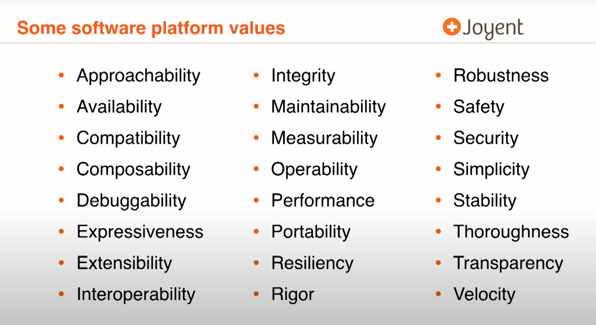

<!--
paginate: true
 -->

<!-- 
_footer: ''
_paginate: false
 -->

<!-- _class: lead -->

# The Rust Core Values

## And where they came from

---

## Core Values: central to the decisions we take.

How do we decide on the "Big Things"?

System Architecture, foundational invariants, Toolability, Interoperability with other systems...

"Which values are you ready to de-prioritize in favor of others?"

---

<!--
_footer: '[Scale By The Bay 2018: Bryan Cantrill, Rust and Other Interesting Things](https://www.youtube.com/watch?v=2wZ1pCpJUIM)'
-->

---

## A system is defined by its Core Values

**C**: Performant, Performant, Portable, Interoperable, Simple

**Scratch**: Approachable, Available, Simple

**Python**: Approachable, Simple, Portable, Expressive, Velocity

**Rust**: Performant, Safe, Secure, Maintainable, Robust

---

### A Core Value Mismatch is **not lethal** -  it merely **limits potential**

* Linux: hard to get contributors

* Java does not have Pointers, yet it has the `NullPointerException` (famously, the "Billion Dollar Mistake")

* C is being used for operating system implementations, which has infected these systems with C's low degree of security

* Out-Of-Order Execution CPUs: Valued Performance over Security, leading to Spectre + Meltdown

---

## Core Value Conflicts in Rust

* Rust prides itself on being energy-efficient - yet the various integrity measures at the project level are wildly expensive

* Programmer Productivity/Ergonomics and IDEability only **became** a priority

* Debuggability in Async

* Highly rigorous syntax rules can cause (at first) unintuitive results

---
